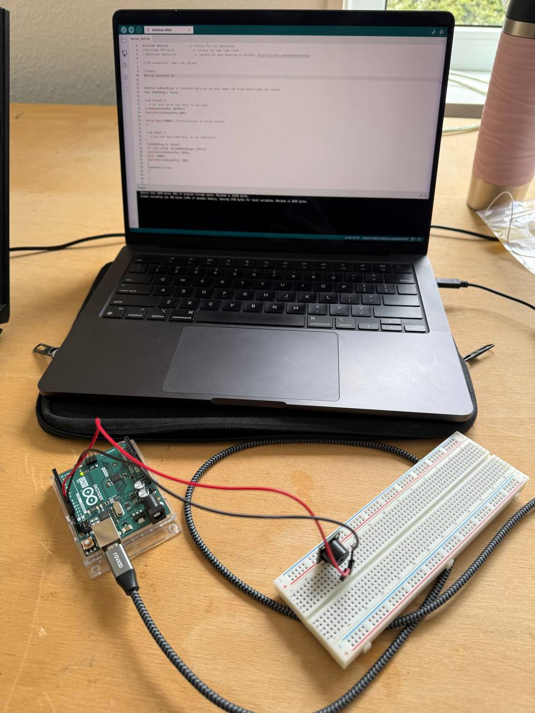
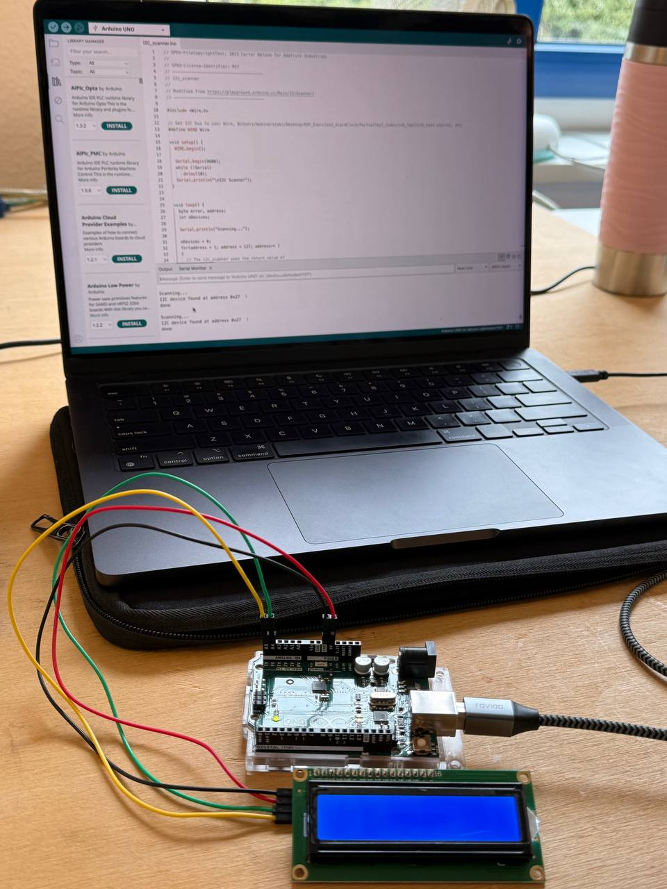
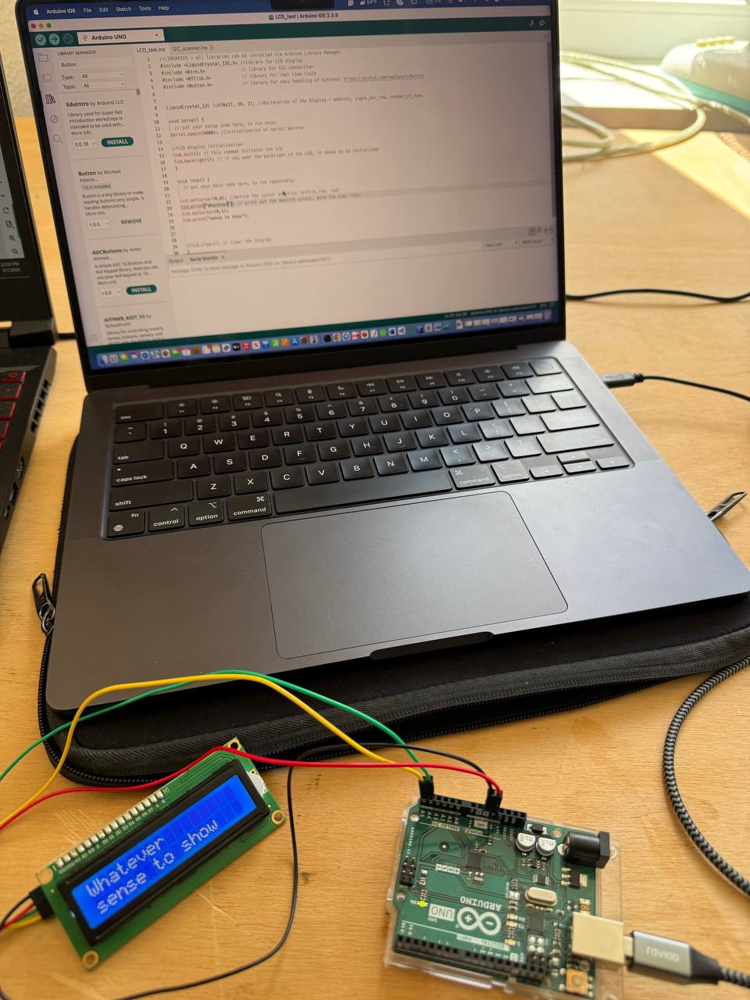

# Digital Design & Fabrication – Exercise 2
## Introduction

In this exercise, we built a functional alarm clock using Arduino Uno and different electronic components. The main goal of the project was to understand how multiple devices can work together in one system.

During the exercise, we worked with an LCD screen, RTC module, buzzer, and push buttons. We also learned how I2C communication works and how Arduino can read inputs and control outputs.

The project was completed step by step by first testing each component separately and then combining all parts into a final alarm clock system. In the final setup, the clock was able to display the current time, set an alarm, and activate a buzzer when the alarm time was reached.

## Sub-circuit 1 – Buzzer

In this exercise, we connected the buzzer to the Arduino Uno and tested it using the provided code.

[Watch the timelapse setup video](videos/timelapse-setup.mp4)

At first, the buzzer did not produce any sound. After checking the circuit and comparing it with the schematic, we noticed that the buzzer was connected in the wrong direction. After correcting the connection, the buzzer started working properly.

The photo below shows the buzzer test circuit on the breadboard.



The buzzer beeped 3 times based on the value defined in the code.

```cpp
#define buzzerPin 4

int howManyRings = 3;

void setup() {

  pinMode(buzzerPin, OUTPUT);

  for(int i = 0; i < howManyRings; i++) {

    digitalWrite(buzzerPin, HIGH);
    delay(1000);

    digitalWrite(buzzerPin, LOW);
    delay(1000);
  }
}

void loop() {
}
```

During the test, we experimented with different delay values and observed how they changed the buzzer timing.

- With `delay(1000)`, the buzzer stayed ON for 1 second.
- With `delay(100)`, the beeps became very short and fast.
- With `delay(2000)`, the beeps became much longer and slower.

We also changed the value of `howManyRings` from 3 to 4, and the buzzer beeped 4 times instead of 3 times.

The video below shows the buzzer working after fixing the connection.

[Download the buzzer test video](videos/buzzer-test.MOV.zip)

From this experiment, we understood that:
- `HIGH` activates the buzzer
- `LOW` stops the sound
- `delay()` controls the timing of the beeps
- ## Sub-circuit 2 – LCD Screen

In this step, we connected the 16x2 LCD screen to the Arduino Uno using the I2C interface. The LCD uses four main connections: VCC, GND, SDA, and SCL. VCC was connected to the 5V pin of the Arduino, GND to the Arduino ground, SDA to the SDA pin, and SCL to the SCL pin.

To communicate with the display, we used the `LiquidCrystal_I2C` library. This library made it easier to print text on the LCD screen through I2C communication.

At first, the LCD screen did not work correctly. We checked the wiring multiple times and tested the connections, but nothing appeared on the display.

The image below shows the first LCD setup where the screen was not working properly.



After troubleshooting the setup, we realized that the LCD itself was defective. We replaced it with another LCD module, and after reconnecting it, the display started working correctly.

The image below shows the working LCD after replacing the defective screen.



To test the display, we uploaded the LCD test code in the Arduino IDE. After the correct LCD was connected, the message appeared successfully on the screen. This confirmed that the Arduino was communicating correctly with the LCD through I2C.

The video below shows the LCD test and setup process.

[Watch the LCD setup video](videos/lcd-test.mp4)

```cpp
#include <Wire.h>
#include <LiquidCrystal_I2C.h>

LiquidCrystal_I2C lcd(0x27, 16, 2);

void setup() {

  lcd.init();
  lcd.backlight();

  lcd.setCursor(0, 0);
  lcd.print("Hello World");
}

void loop() {
}
```

From this step, we understood how I2C communication works and how the Arduino can send text data to an external display.
