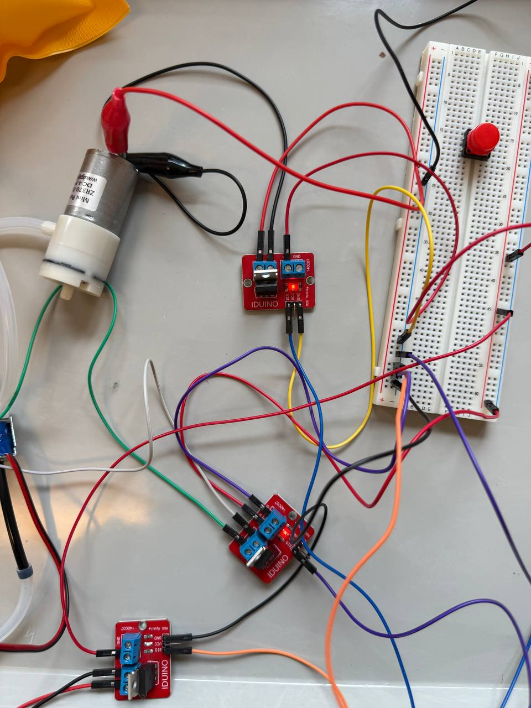
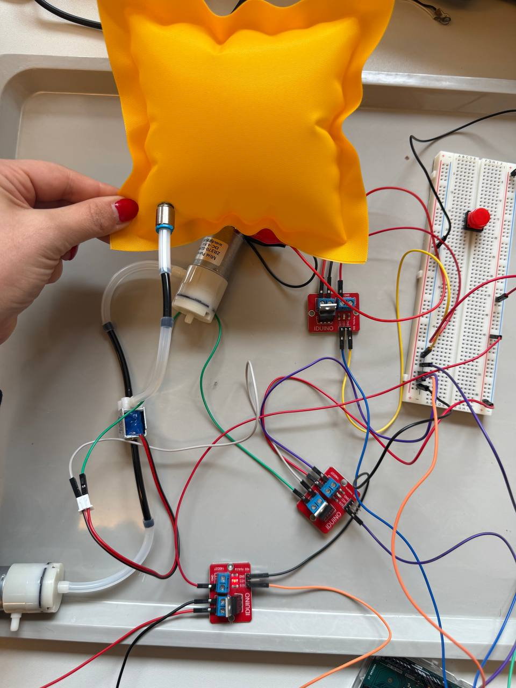
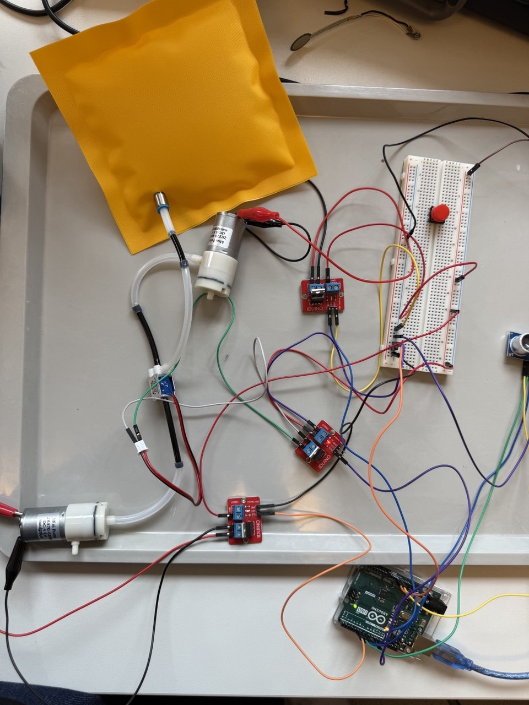
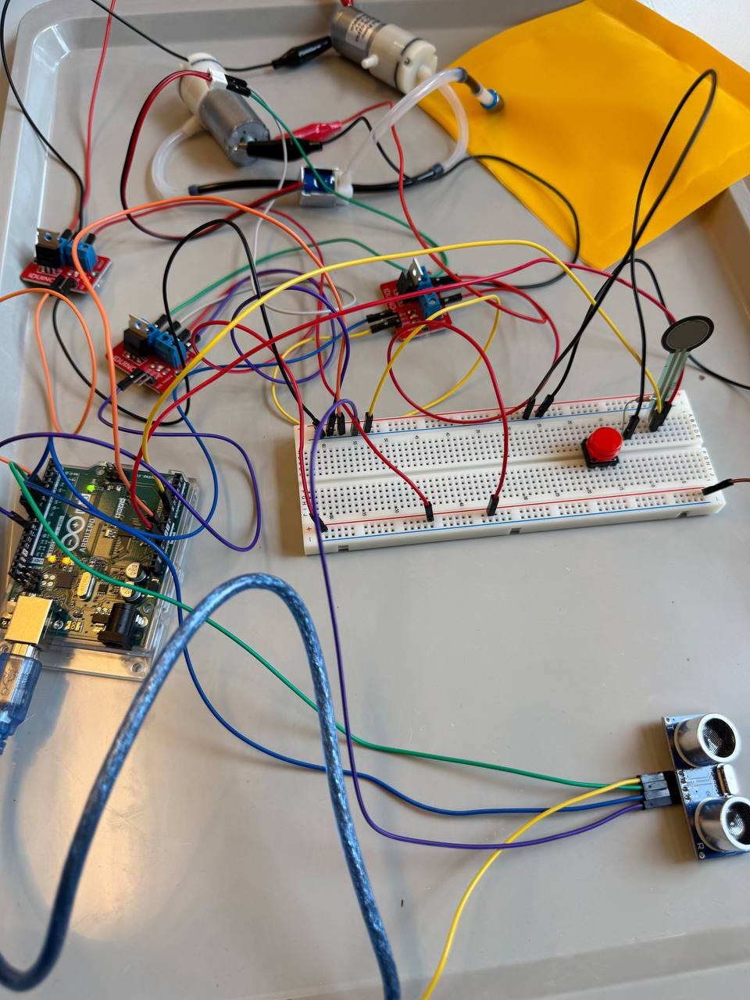
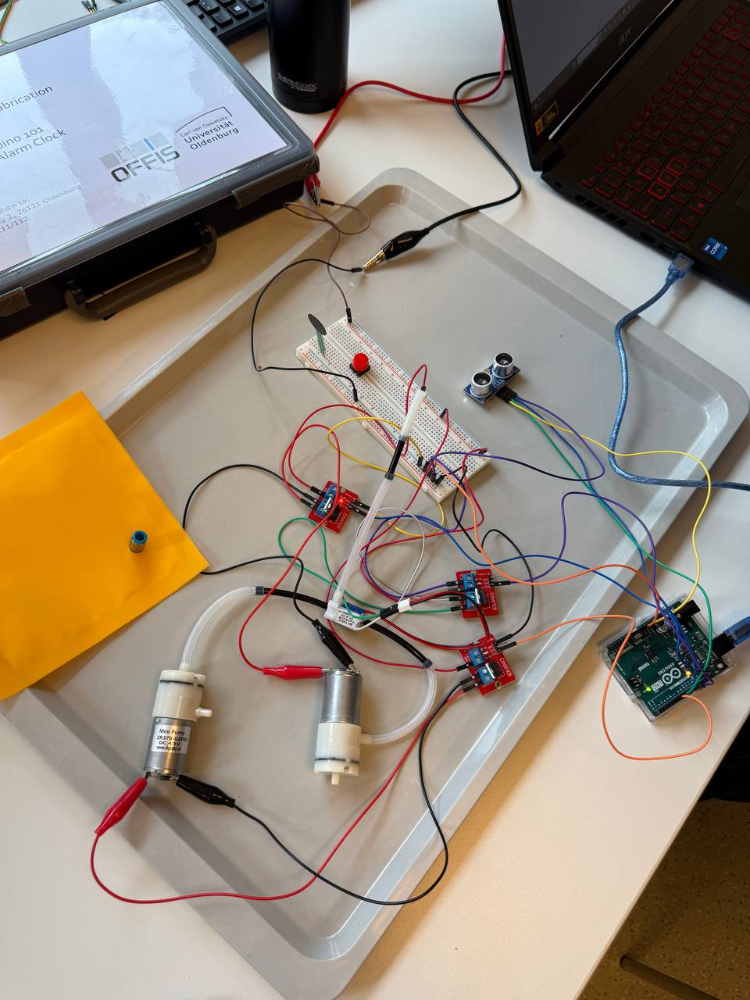
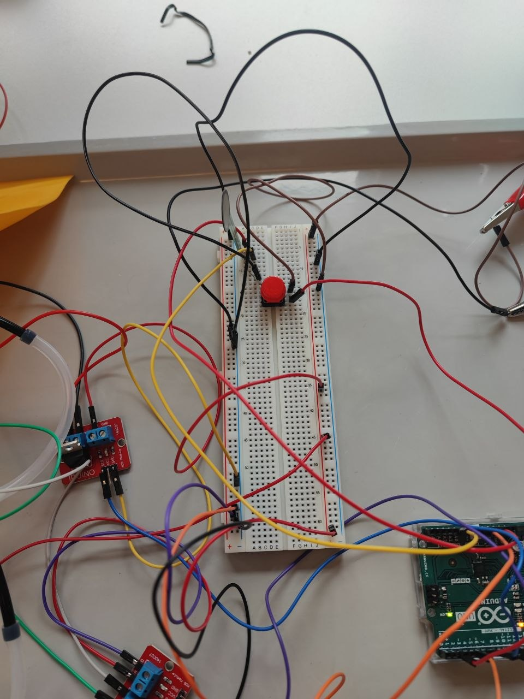

# Digital Design & Fabrication – Exercise 3
# Pneumatic Stress Pillow

**Student:** Zahra Rajabi, Fatemeh Mazaherian  
**Course:** Digital Design & Fabrication  
**University:** Carl von Ossietzky University Oldenburg  
**Lecturers:** Prof. Dr. Susanne Boll-Westermann, Mikołaj Woźniak, Tobias Lunte

## Components Overview

- Arduino Uno

- Breadboard

- 2x Air Pumps

- Air Valve

- 3x MOSFET Modules

- Silicone Tubes

- Force-Sensitive Sensor

- Inflatable Pillow

- USB Cable

- Alligator Clips

 

## Overview

For this project, we worked with different pneumatic and electronic components, including an Arduino Uno, air pumps, an air valve, MOSFET modules, silicone tubes, and a force-sensitive sensor. Using these components, we decided to create an interactive stress pillow system.

The inflatable pillow was connected to the pneumatic system, where the pumps controlled inflation and deflation while the valve switched the airflow direction. The MOSFET modules were used to safely control the pumps and valve through the Arduino.

To make the interaction more responsive, a force-sensitive sensor was integrated into the system. When pressure was applied, the Arduino reacted to the sensor input and controlled the airflow inside the pillow accordingly.


---

## Part A – Pneumatic & Electrical Circuit

### Electrical Wiring

Three IRF520 MOSFET modules were used to control the pneumatic actuators. Each MOSFET module was connected to a separate actuator component.

- One MOSFET controlled the inflation pump.
- One MOSFET controlled the deflation pump.
- One MOSFET controlled the air valve.

The SIG pins of the MOSFET modules were connected to Arduino digital output pins, while the VCC and GND pins were connected to the Arduino power rails through the breadboard.

The pumps and valve were powered using an external laboratory power supply because they required higher current than the Arduino could safely provide directly.

All actuator grounds and the Arduino GND were connected together to create a shared ground connection for stable operation.

### Circuit Images





---

### Pneumatic Assembly

The system uses two air pumps:
- The first pump inflates the pillow.
- The second pump removes air from the pillow for deflation.

An air valve was placed between the pumps and the inflatable pillow to switch the airflow direction between the two pneumatic paths.

When the valve is powered, the airflow direction changes. When it is unpowered, the default airflow path remains active.

The inflatable pillow was connected to the pneumatic system using silicone tubes. During assembly, special attention was required for the tubing direction and valve connections to ensure correct airflow behavior.

### Pneumatic Setup



---

### Initial Testing

Before integrating the force-sensitive sensor, a simple Arduino test sketch was created to verify the pneumatic system and actuator behavior.

The code sequentially controlled:
- the inflation pump
- the deflation pump
- and the air valve

During the test:
- the pillow inflated for 10 seconds,
- paused briefly,
- then deflated for 5 seconds.

This helped verify:
- correct MOSFET switching
- airflow direction
- valve behavior
- and overall pneumatic functionality.

The LED indicators on the MOSFET modules were also used for debugging. If the LED turned on but the pump did not work, the issue was usually related to the power supply or actuator wiring.

## Test Code

```cpp
const int pumpInflate = 5;
const int pumpDeflate = 8;
const int valvePin = 10;

void setup() {

  pinMode(pumpInflate, OUTPUT);
  pinMode(pumpDeflate, OUTPUT);
  pinMode(valvePin, OUTPUT);

  digitalWrite(pumpInflate, LOW);
  digitalWrite(pumpDeflate, LOW);
  digitalWrite(valvePin, LOW);
}

void loop() {

  // Inflate
  digitalWrite(valvePin, HIGH);
  digitalWrite(pumpDeflate, LOW);
  digitalWrite(pumpInflate, HIGH);

  delay(10000);

  digitalWrite(pumpInflate, LOW);

  delay(2000);

  // Deflate
  digitalWrite(valvePin, LOW);
  digitalWrite(pumpDeflate, HIGH);

  delay(5000);

  digitalWrite(pumpDeflate, LOW);
  digitalWrite(valvePin, LOW);

  delay(3000);
}
```

### Test Video

[Watch Test Video](videos/test_video.mp4)

---
## Resources

During the project, we used different online resources and product pages to better understand the pneumatic components and MOSFET modules.

### Air Pump
[Adafruit Air Pump Product Page](https://www.adafruit.com/product/4699)

From this page, we learned about:
- operating voltage
- current consumption
- airflow direction
- polarity requirements

### Air Valve
[Adafruit Air Valve Product Page](https://www.adafruit.com/product/4663)

This resource helped us understand:
- valve port behavior
- switching states
- airflow routing

### IRF520 MOSFET Module
[Arduino Forum – IRF520 MOSFET Module](https://forum.arduino.cc/t/irf520-mosfet-module/487455)

This discussion helped us better understand:
- MOSFET switching behavior
- external power requirements
- correct Arduino-to-MOSFET wiring


## Part B – Sensor Interaction

For the interaction part, we used a Force Sensitive Resistor (FSR). The idea was to make the stress pillow react to physical pressure from the user.

The FSR was connected to the Arduino as an analog input. One side of the sensor was connected to power, and the other side was connected to analog pin A0. A 10K resistor was used as a pull-down resistor between A0 and GND. This setup allowed the Arduino to read changing analog values depending on how much pressure was applied to the sensor.

Before combining the sensor with the pneumatic system, we first tested the FSR separately using the Serial Monitor. The test code printed the raw analog value and described the pressure level as no pressure, light touch, light squeeze, medium squeeze, or big squeeze.

### Sensor Interaction Setup





---

## Sensor Test Code

```cpp
/* FSR simple testing sketch.

Connect one end of FSR to power, the other end to Analog 0.
Then connect one end of a 10K resistor from Analog 0 to ground.

For more information see www.ladyada.net/learn/sensors/fsr.html
*/

int fsrPin = 0;
int fsrReading;

void setup(void) {

  Serial.begin(9600);
}

void loop(void) {

  fsrReading = analogRead(fsrPin);

  Serial.print("Analog reading = ");
  Serial.print(fsrReading);

  if (fsrReading < 10) {
    Serial.println(" - No pressure");

  } else if (fsrReading < 200) {
    Serial.println(" - Light touch");

  } else if (fsrReading < 500) {
    Serial.println(" - Light squeeze");

  } else if (fsrReading < 800) {
    Serial.println(" - Medium squeeze");

  } else {
    Serial.println(" - Big squeeze");
  }

  delay(1000);
}
```
---

### Sensor Test Video

[Watch Sensor Test Video](videos/sensor_test.mp4)

---

### Sensor Resource

[Adafruit FSR Guide](https://learn.adafruit.com/force-sensitive-resistor-fsr/using-an-fsr)

From this guide, we learned:
- how to connect the FSR to Arduino
- why a 10K pull-down resistor is needed
- how to read analog pressure values from pin A0
- how to use the Serial Monitor to test different pressure levels


## Combining Both Parts

After testing the pneumatic system and the force-sensitive sensor separately, both parts were combined into one interactive setup.

The Arduino continuously monitored the FSR sensor values and reacted to physical pressure applied by the user. Based on the sensor input, the pumps inflated the stress pillow through the pneumatic system.

Later in the project, we decided to add an additional push button to improve the interaction. The idea was that:
- the pillow inflates when pressure is applied to the FSR sensor,
- and deflates when the red push button is pressed.

To implement this behavior, the Arduino code was modified to include the push button input and additional control logic for deflation.



During testing, the button initially did not work correctly even though the Serial Monitor values appeared normal. After checking the code and testing the system multiple times, we discovered that the issue was caused by incorrect wiring. The button GND connection had not been properly connected to the circuit ground.


After reconnecting the wiring correctly, the button worked as expected and the pillow could successfully inflate and deflate through two different user interactions.

### Combined System

[Watch Final Demo](videos/final_demo.mp4)

---

## Problems & Solutions

During the project, several technical challenges occurred during assembly and testing.

Some of the main issues included:
- incorrect wiring connections
- unstable airflow direction
- confusion with valve ports
- sensor sensitivity adjustments
- debugging MOSFET connections
- button wiring issues

One of the main debugging challenges happened after adding the push button interaction. Although the Serial Monitor outputs appeared correct, the button still did not respond properly. After checking the circuit multiple times, the issue was traced back to an incorrect GND connection in the wiring setup.

Most of the problems were solved by testing each component separately, checking the wiring step by step, and adjusting the Arduino code and pneumatic tubing during debugging.

The LED indicators on the MOSFET modules were especially useful during troubleshooting because they helped verify whether the Arduino signals were working correctly.

## Conclusion

During this exercise, we learned how different Arduino components can be integrated into one complete interactive system. Step by step, we tested and combined sensors, pneumatic components, MOSFET modules, push buttons, pumps, and valves into the final stress pillow prototype.

One of the most important parts of the project was troubleshooting and solving technical problems. Several issues appeared during the development process, such as wiring mistakes, unstable connections, and component synchronization problems. By testing the hardware step by step and modifying the Arduino code, we were able to improve the system functionality.

We also experimented with different sensor values, alarm sounds, button interactions, and pneumatic behaviors. This helped us better understand how Arduino systems react to physical interaction and user input in real time.

Overall, this project gave us practical experience with Arduino programming, electronics, sensor integration, actuator control, and interactive prototyping.
