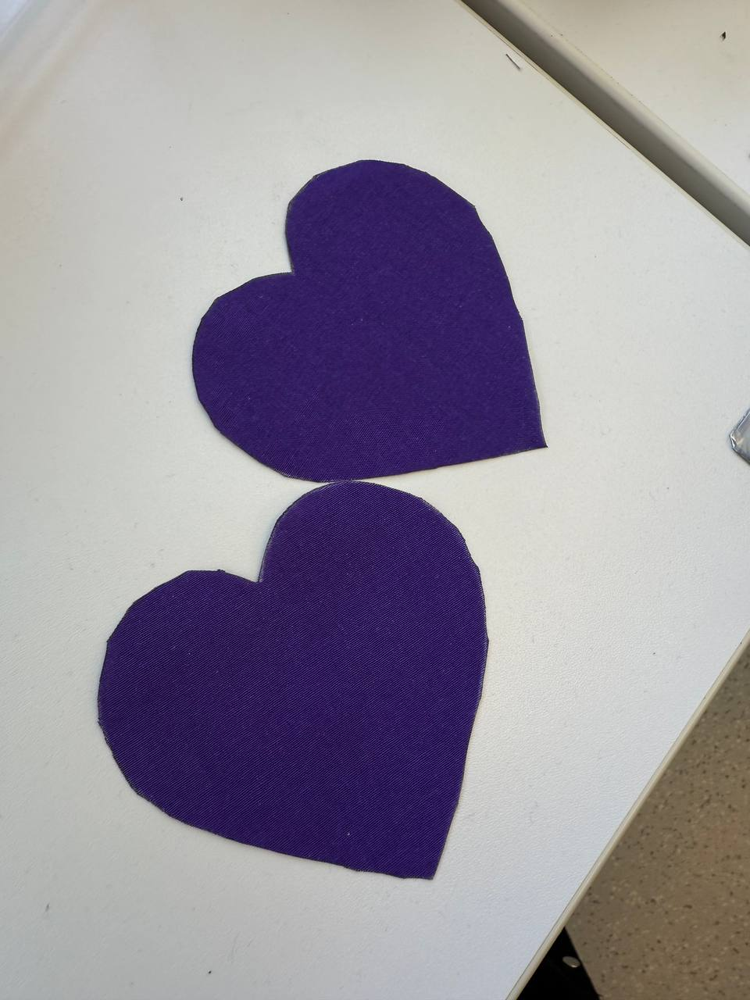
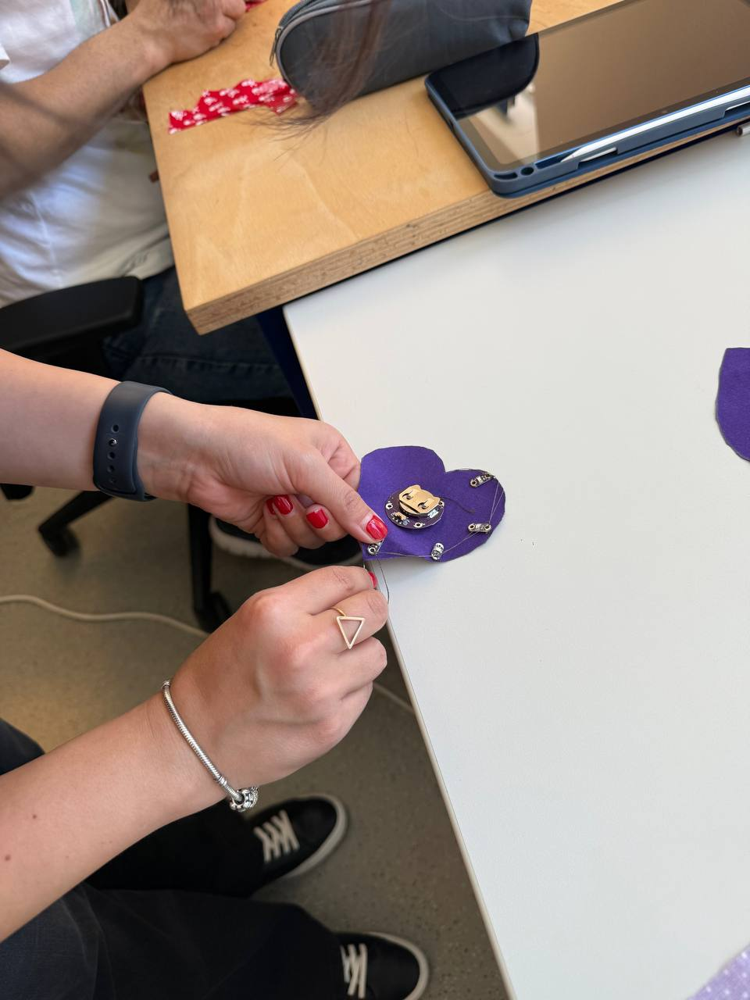
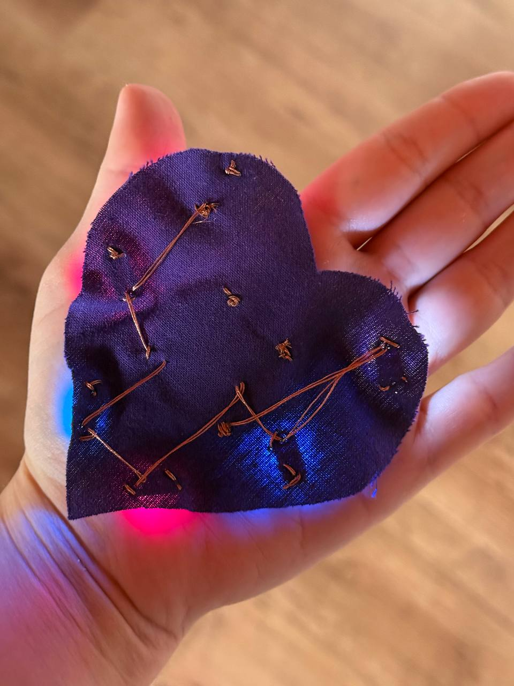
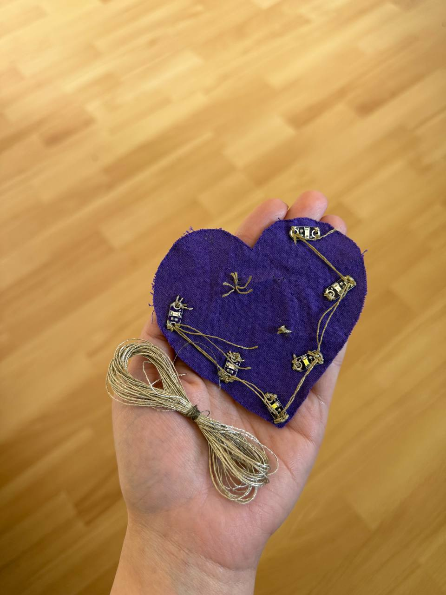
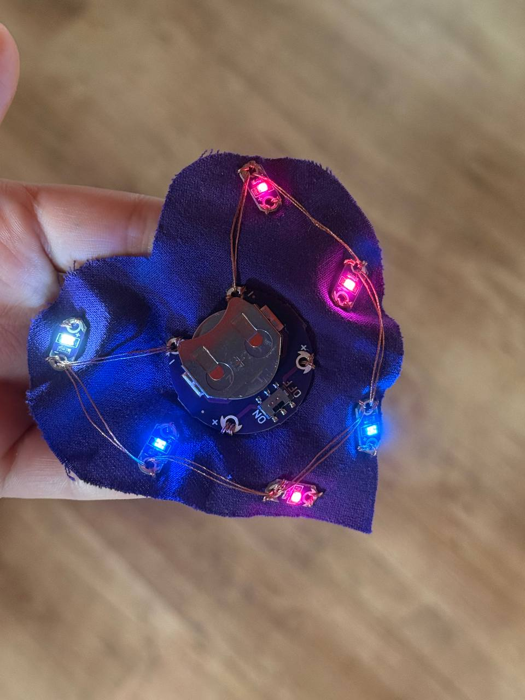
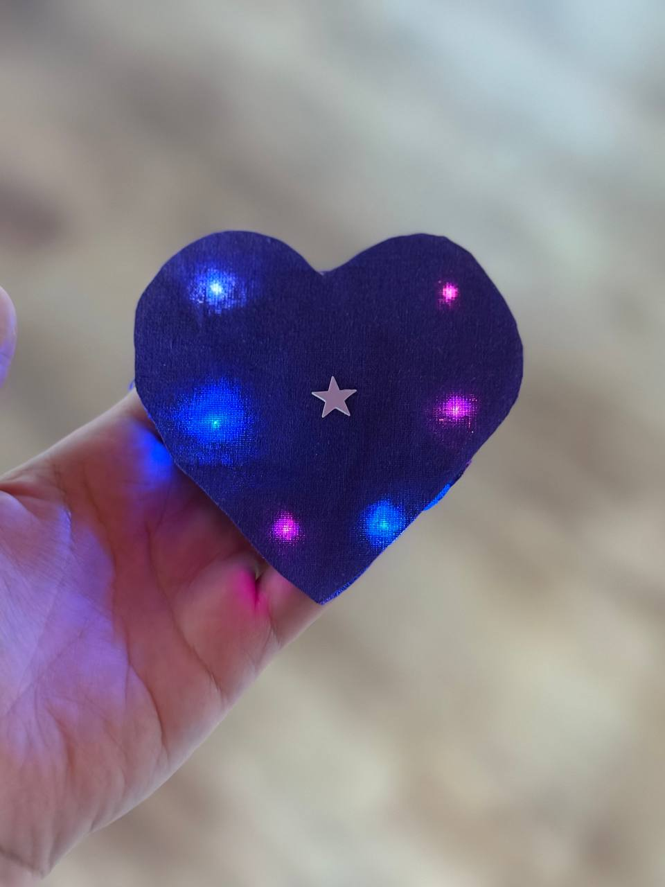

# Digital Design & Fabrication – Exercise 4  
# E-Textile LED Heart Patch

**Student:** Zahra Rajabi  
**University:** Carl von Ossietzky University Oldenburg  
**Lecturers:** Prof. Dr. Susanne Boll-Westermann, Mikołaj Woźniak, Tobias Lunte

---

## Project Overview

In this exercise, I created an e-textile heart-shaped patch with six sewable LEDs, a coin-cell battery holder, and conductive thread.
## How It Was Made

  <video src="images/demo.mp4" width="650" controls></video>

---

## Materials

  

---

## Preparing the Textile Base
I chose a heart shape for my patch and cut two textile pieces. One layer was used as the base for the circuit, and the second layer was used as the cover.

  

---

## Sewing Process

To avoid short circuits, I separated the conductive paths. The positive connections were sewn on the back side of the textile, while the negative connections were sewn on the front side.

    
  

## Testing and Debugging

At first, the LEDs did not work correctly because the conductive thread had very high resistance. Later, I also realized that I had connected the LEDs in series instead of parallel.

  

---

## Final Result

After changing the conductive thread and redesigning the circuit as a parallel circuit, the LEDs worked correctly.

    
  

---

## Problems and Challenges

The first problem appeared after I had finished sewing the circuit. When I inserted the battery, none of the LEDs turned on. After checking the circuit, I discovered that the conductive thread had very high electrical resistance.

After replacing the thread, I faced another issue. Some LEDs did not light up correctly because I had connected them in series instead of parallel. Since conductive thread already has resistance, the series circuit caused a voltage drop.

To solve this, I redesigned the circuit as a parallel circuit.

Another challenge was preventing short circuits. The positive and negative conductive paths must not touch each other. Therefore, I sewed the positive connections on the back side of the textile and the negative connections on the front side.

---

## What I Learned

- how to create a soft circuit on textile
- how conductive thread works
- why thread resistance matters
- the difference between series and parallel circuits
- why parallel circuits are better for multiple LEDs
- how to troubleshoot e-textile circuits
- why positive and negative paths must not touch

---

## Final Reflection

This project helped me understand that e-textile circuits require both electronic thinking and careful handcrafting. Small details, such as the type of conductive thread or the way LEDs are connected, can strongly affect the final result.
