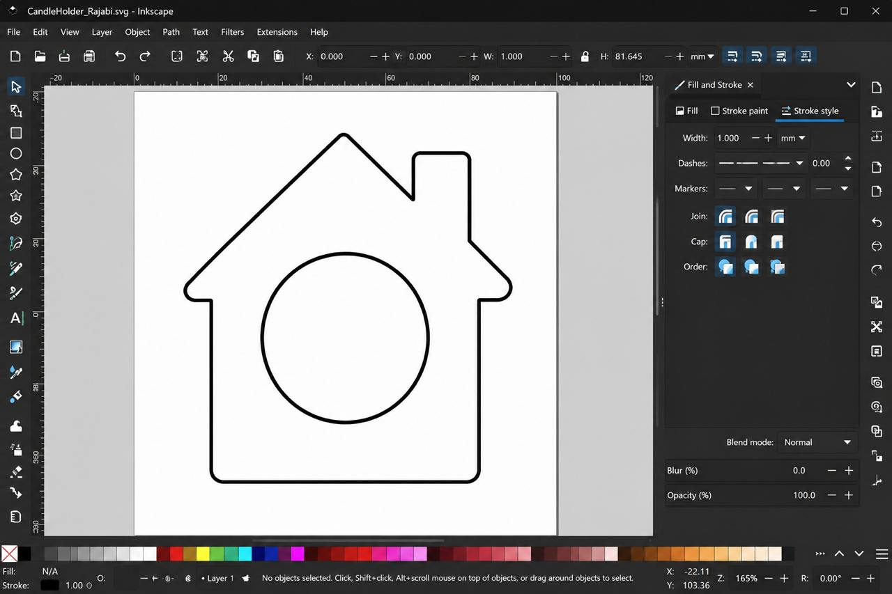
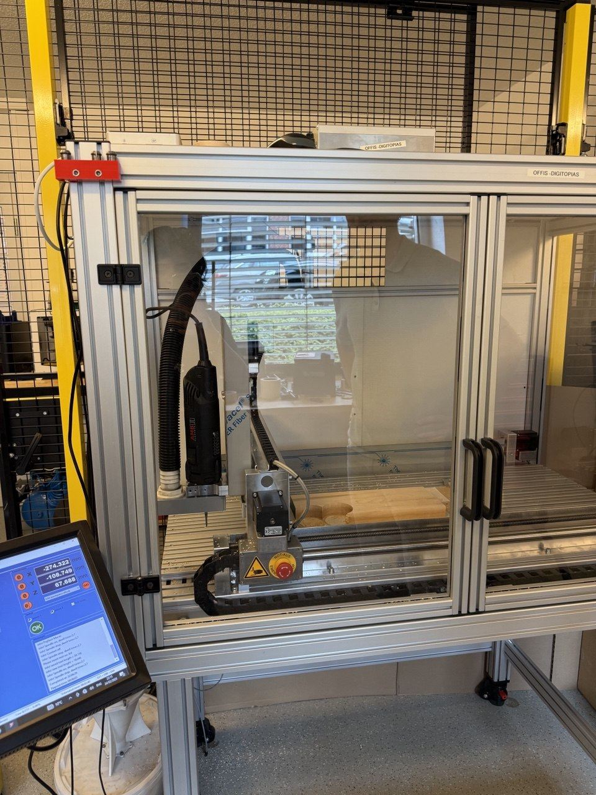
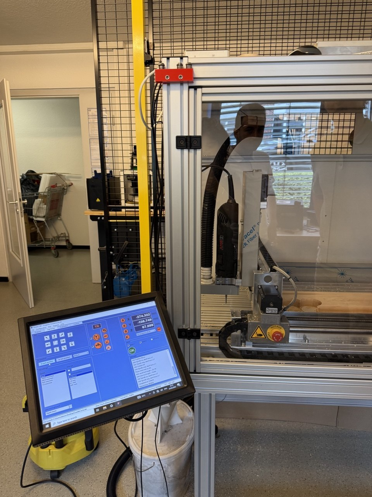
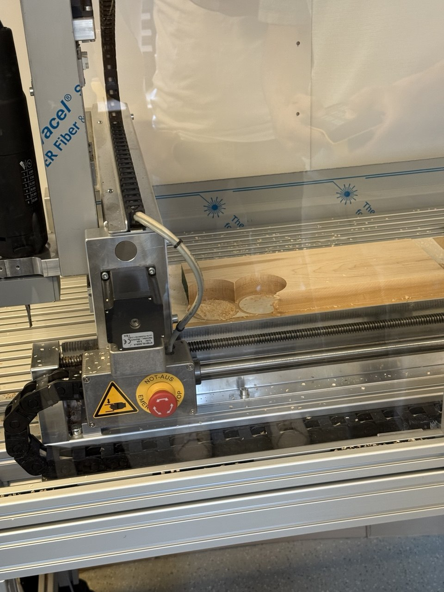
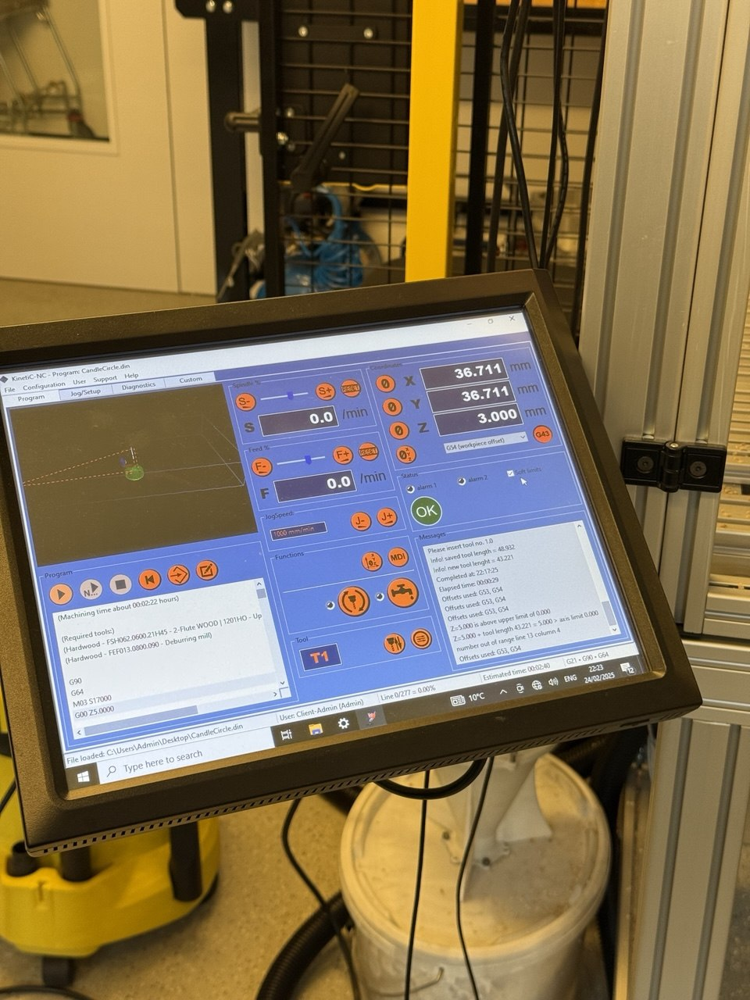
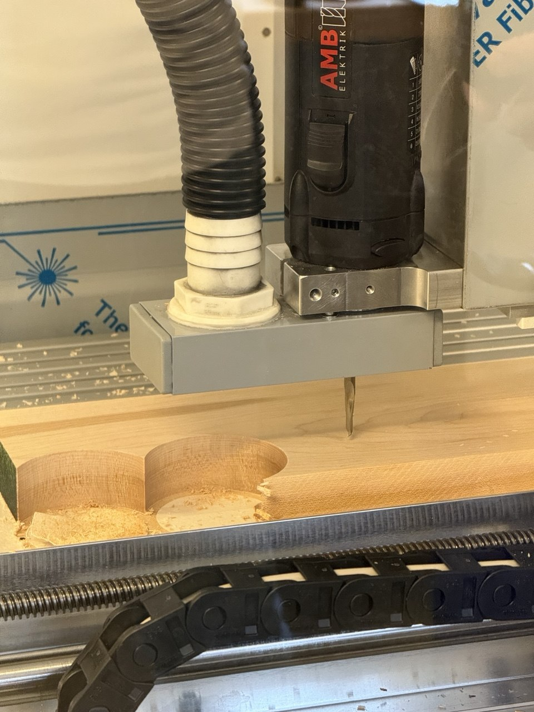
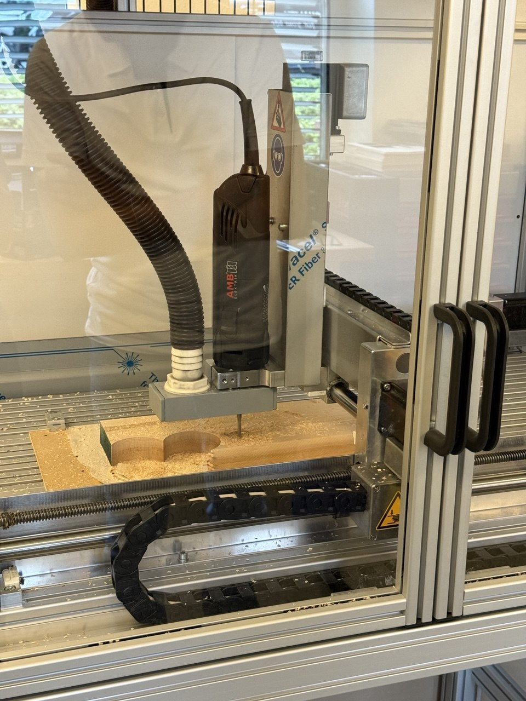
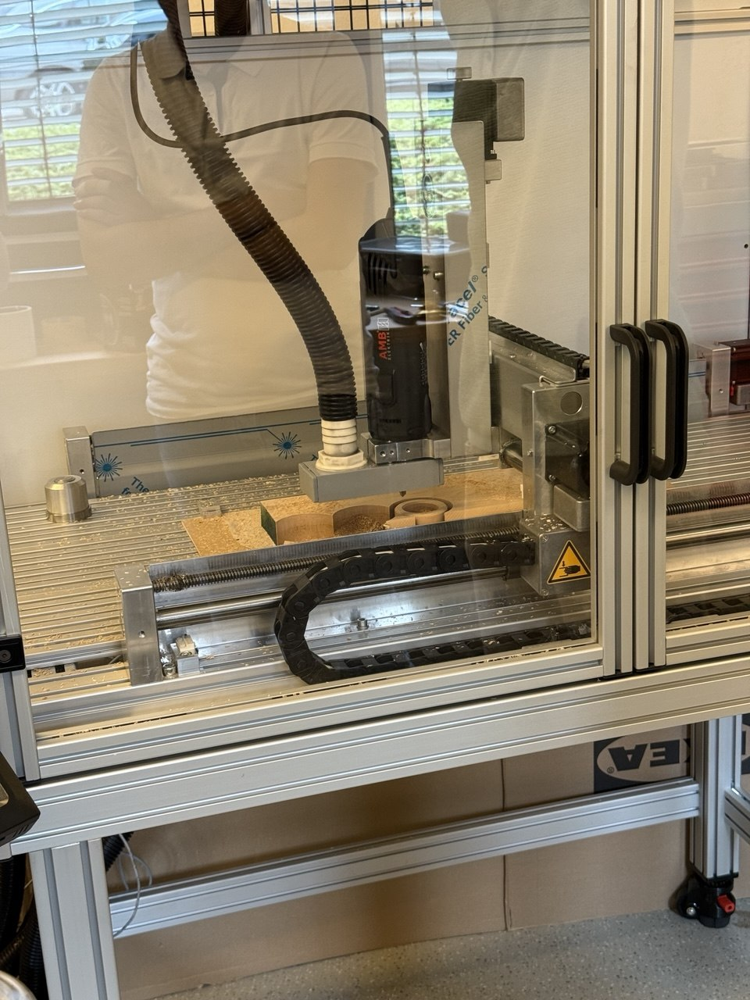
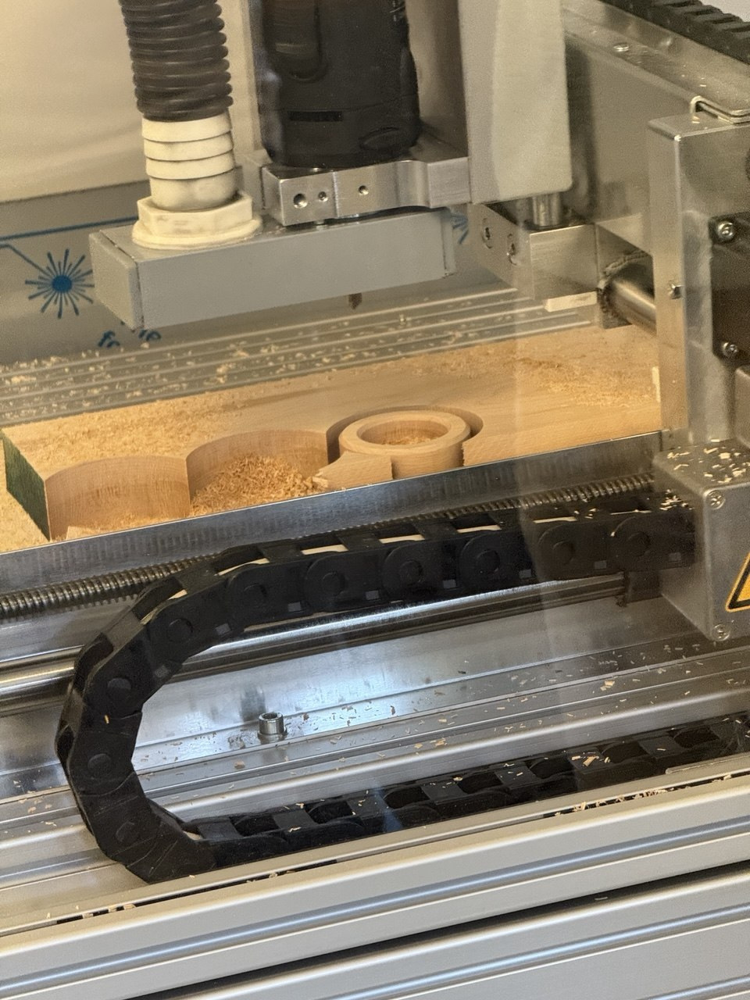
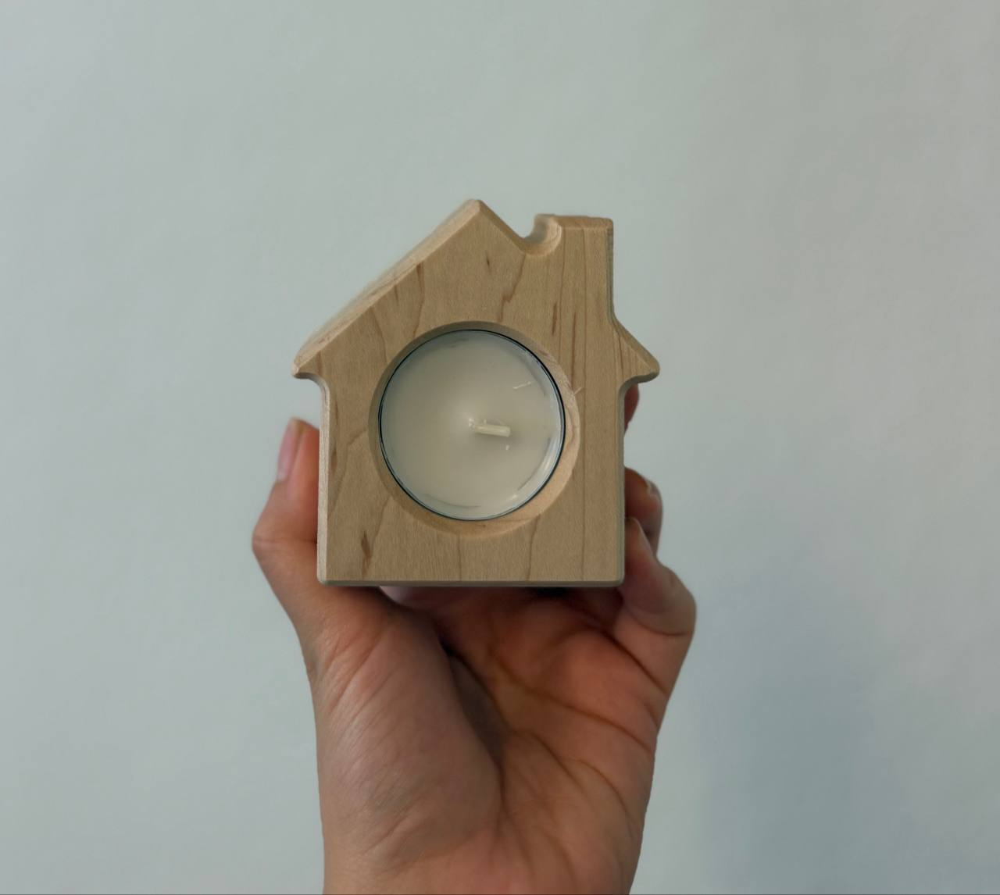

# Digital Design & Fabrication – Exercise 5 

## CNC Milling Portfolio

**Student:** Zahra Rajabi
**Course:** Digital Design & Fabrication  
**University:** Carl von Ossietzky University Oldenburg  
**Lecturers:** Prof. Dr. Susanne Boll-Westermann, Mikołaj Woźniak, Tobias Lunte
---

## Project Overview

This exercise introduced the basic workflow of CNC milling. The goal was to design a wooden tea light candle holder in Inkscape and learn how a digital design is prepared for manufacturing.

During the workshop, the instructors explained the CNC milling process, from preparing the material to machining the final object. Our designs were then milled from hardwood using the CNC machine.

---

## My Design

For this exercise, I designed my own candle holder as a vector drawing in Inkscape.

I created a simple house-shaped design using basic geometric shapes: a rectangle for the main body, a smaller rectangle for the chimney, and a triangle for the roof. To give the roof a softer appearance, I rounded the corners of the triangle using the Node Tool, creating a cleaner and more decorative outline.

A circular pocket was added in the center to hold a standard candle.

  
  

---

## Workshop

Before the machining process, we were introduced to the CNC machine and its main components. The instructors explained how the workpiece is fixed, how the machine origin is set, and how the milling program is prepared before machining begins.

### CNC Machine

  
  

---

## CNC Milling Demonstration

During the class, the instructors demonstrated the milling process using a sample workpiece while explaining each machining step. This included creating the pocket for the candle and cutting the outer profile.

  
  

  
  

  
  

---

## Final Result

The final candle holder was manufactured from hardwood using my original design. Comparing the finished piece with the vector drawing made it easy to see how accurately the CNC machine reproduced the shape while preserving the overall design.

  

---

## Reflection

This workshop was my first introduction to CNC milling. Although we did not operate the machine ourselves, watching the live demonstration made it much easier to understand how the CNC workflow is carried out in practice. Seeing the different stages, from machine setup to the finished wooden piece, helped me connect the design process with the final manufactured result.
