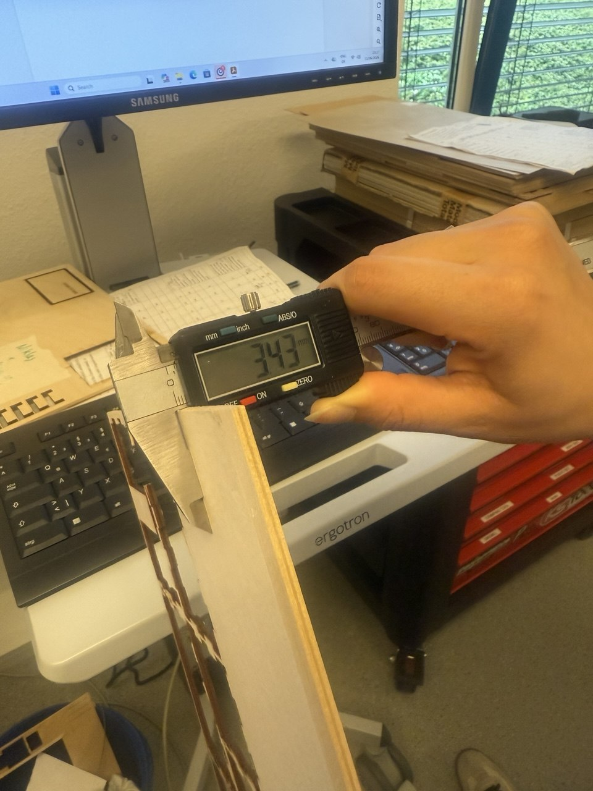
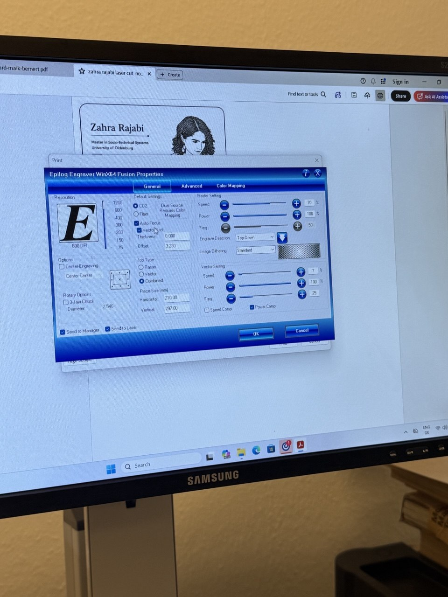
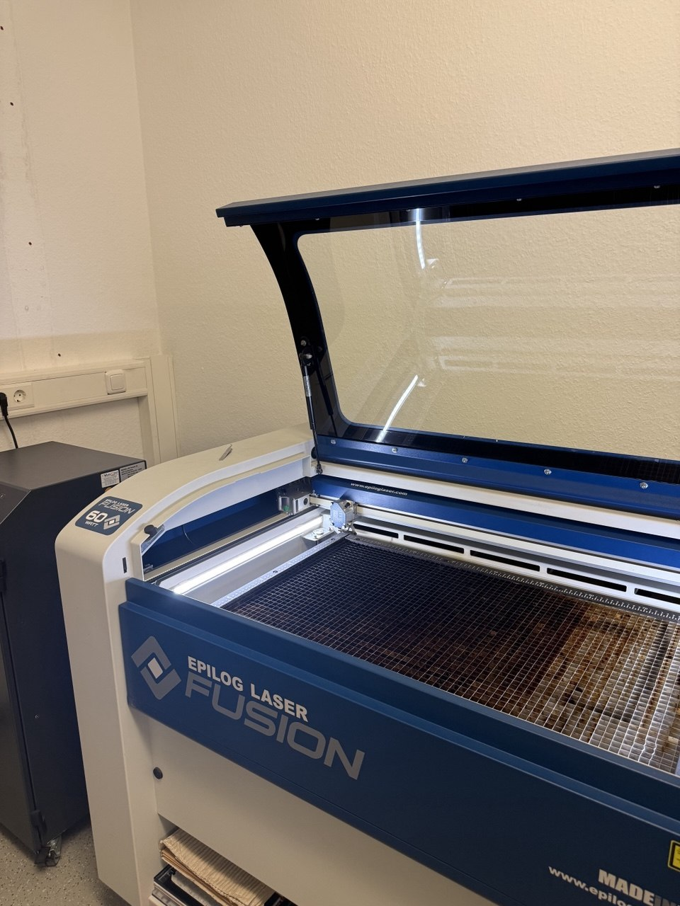
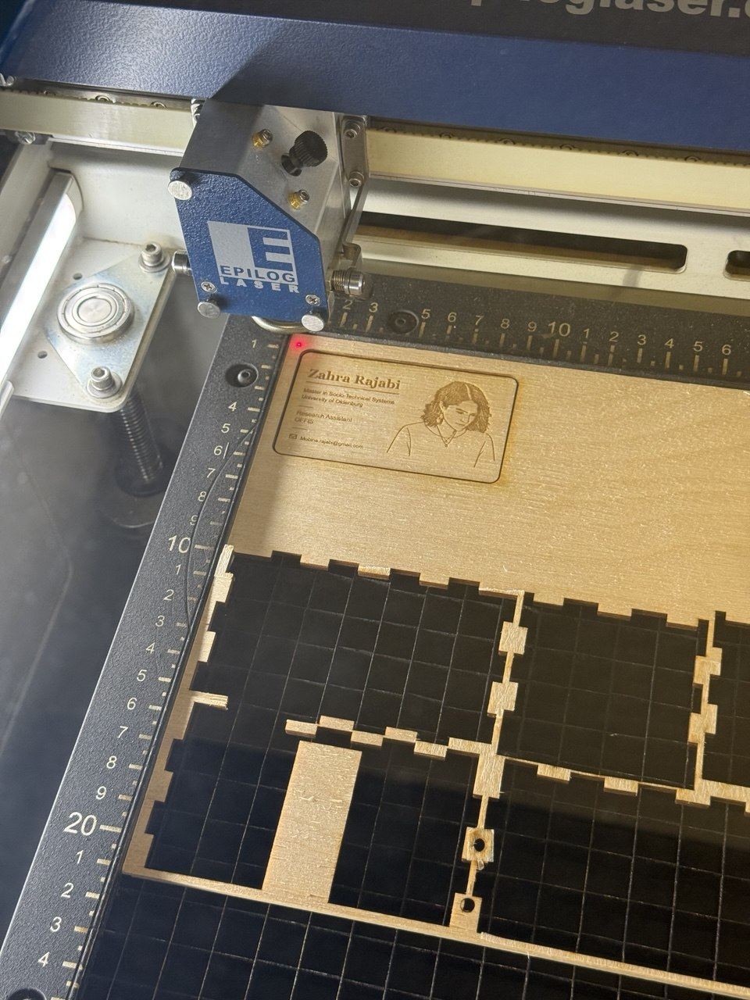
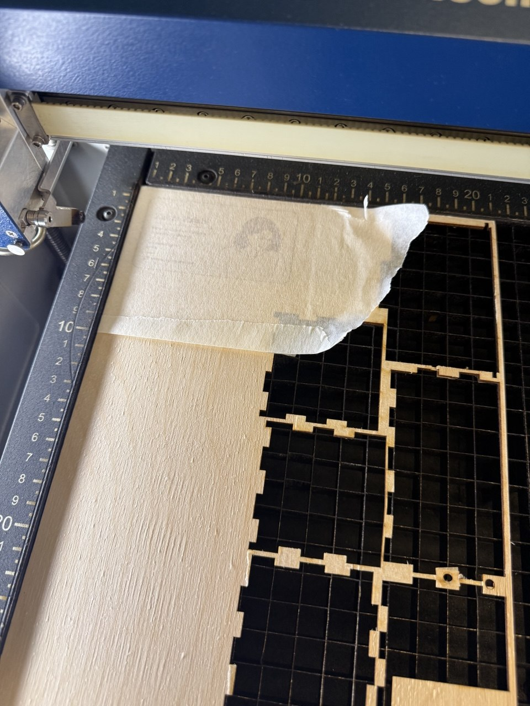
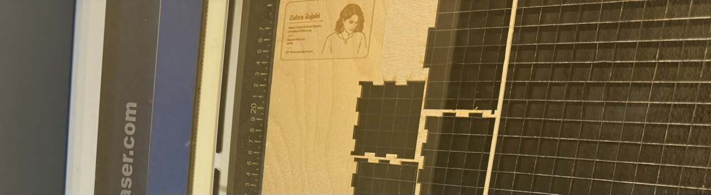
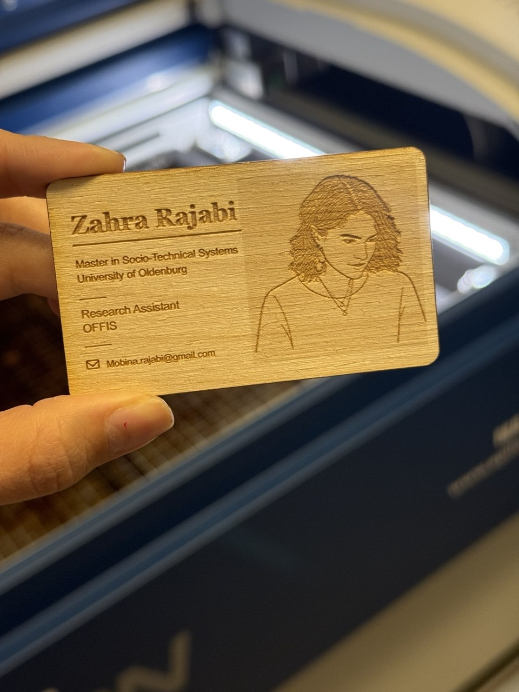

# digital design and Fabrication - Exercise 6 
# Laser cut Business Card

**Student:** Zahra Rajabi  
**University:** Carl von Ossietzky University Oldenburg  
**Course:** Digital Design and Fabrication

---

# Project Overview

For this exercise, I designed and fabricated a personal business card using Inkscape and an Epilog Fusion laser cutter. I wanted the card to represent both my academic background and my personal style, so I combined my contact information with a laser-engraved portrait.

The card was produced from plywood using both raster engraving and vector cutting. The final design includes rounded corners, engraved text, and a minimalist portrait.

---

# Design Process

I started by creating the layout in Inkscape. The card contains my name, academic information, workplace, and email address. To make the design more personal, I also included a simplified portrait based on a photograph.

Because the business card is relatively small, I tried to keep the design clean and easy to read. The portrait and text were prepared for raster engraving, while the outer contour was prepared for vector cutting.

---

# Material Selection

For this project, I chose plywood because it engraves well and provides a natural appearance that works nicely with laser fabrication.

Before starting the fabrication process, the material thickness was measured using a digital caliper.

The measured thickness was approximately 3.43 mm.

## laser_machine Preparation

---

# Fabrication Process

The business card was fabricated using an Epilog Fusion laser cutter.

## Laser Cutter

The engraving step was completed first using raster mode.

## Engraving Process

After the engraving was finished, the machine cut the outer contour of the card using vector mode.

## Fabrication Video

A short video of the laser engraving and cutting process can be found below:

[Laser Fabrication Video](video/laser_cutting.mp4)

---

# Failed Attempt

My first attempt was not successful.

After the engraving process had finished, I decided to place masking tape on the material before continuing. I then restarted the job, expecting the machine to continue with the cutting process.

However, the laser cutter started the entire file again and repeated the engraving process. Since the material was no longer perfectly aligned, the second engraving pass was slightly shifted.

As a result, the text and portrait became blurry and duplicated.

Although the card was still recognizable, the quality was not acceptable.

---

# Improvement

After identifying the problem, I prepared a new piece of plywood and repeated the entire fabrication process from the beginning.

This time, the material remained fixed throughout the whole job and the process was completed without interruption. The engraving and cutting aligned correctly, producing a much cleaner result.

---

# Final Result

The second attempt produced the final business card.

I was happy with the final result because the portrait remained recognizable and the engraved information was still easy to read despite the small size of the card. The plywood material also gave the card a unique appearance compared to a traditional paper business card.

---

# Reflection

This was my first time designing and producing a business card with a laser cutter.

The most challenging part was not creating the design itself but understanding the fabrication workflow. The mistake during the first attempt showed me how important it is to keep the material in exactly the same position throughout the entire process.

Even though I had to repeat the fabrication, the failed attempt helped me better understand how laser cutting and engraving jobs are executed. It also taught me to think more carefully about the order of operations before starting a fabrication process.

Overall, I enjoyed this exercise because it allowed me to combine graphic design with digital fabrication and create something that I can actually use in the future.
