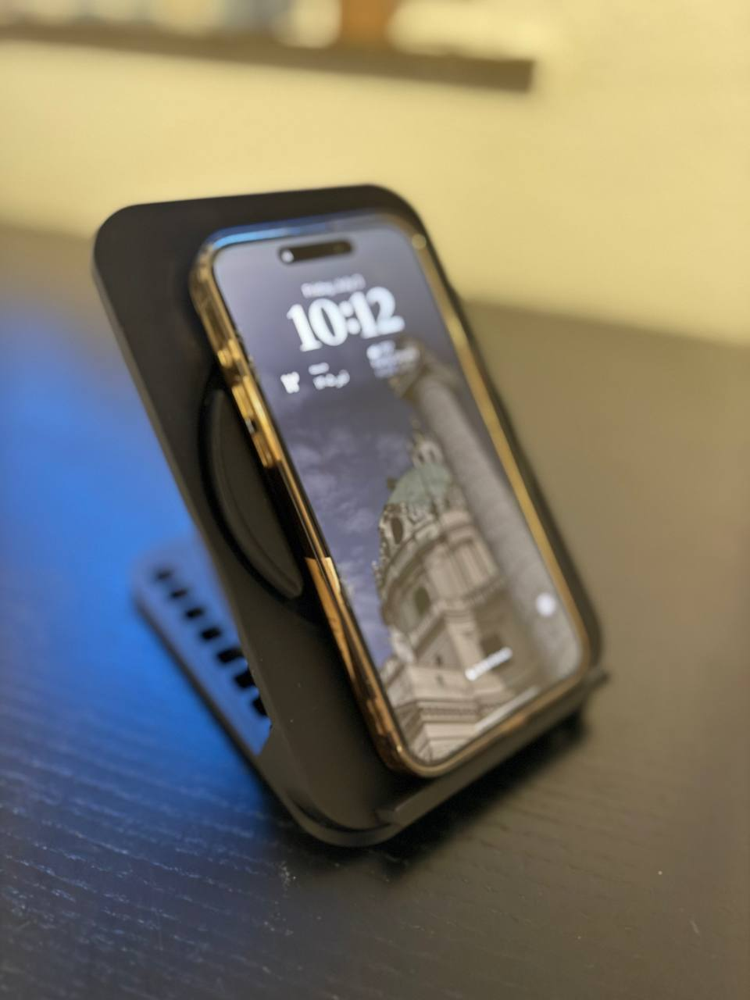
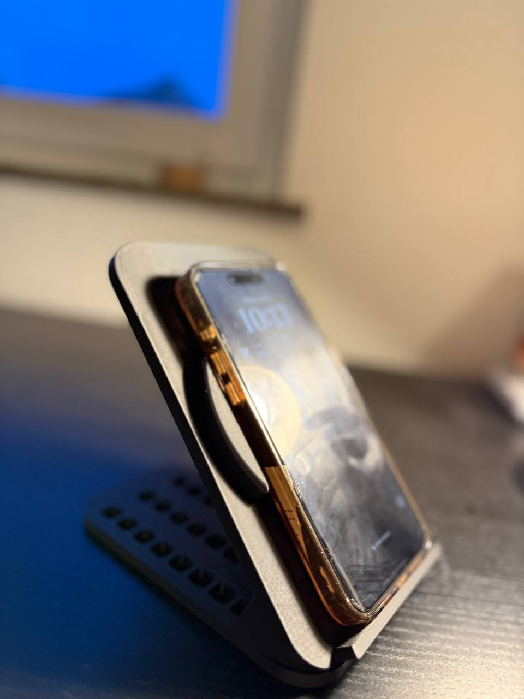
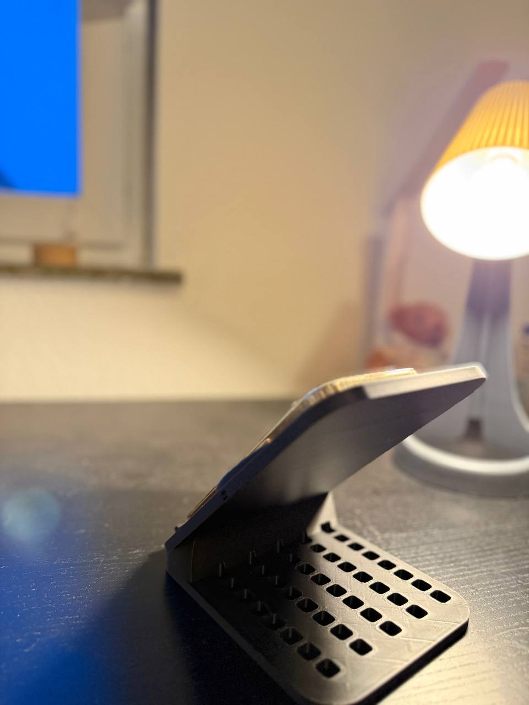
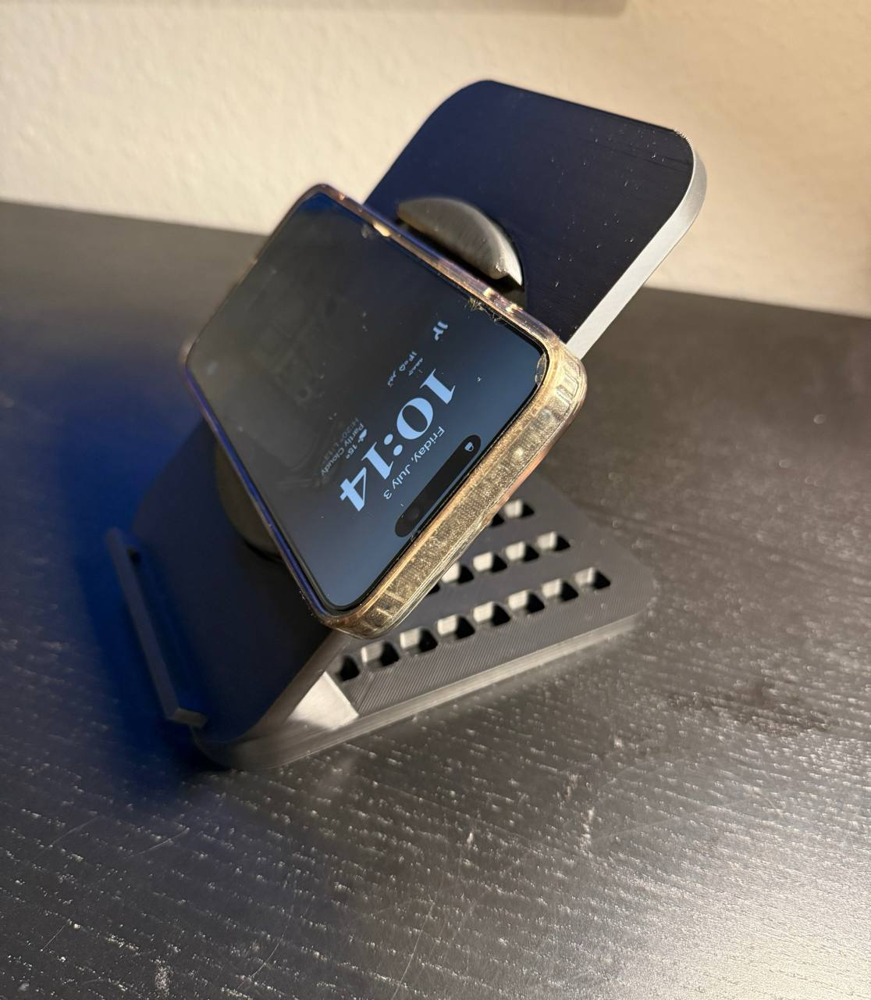

# Exercise 8 – Rotating MagSafe Phone Holder

**Course:** Digital Design and Fabrication (inf175)

**Software:** Autodesk Fusion 360, QIDI Studio

**Printer:** QIDI Q2

**Material:** PLA Rapido

---

# Project Overview

The goal of this exercise was to design a practical smartphone accessory suitable for 3D printing. I decided to design a rotating MagSafe phone holder for my iPhone 16 Pro Max because I wanted a stand that could securely hold my phone while allowing it to rotate between different viewing positions.

Before starting the project, I explored several existing phone holder designs for inspiration. Rather than copying an existing model, I combined different ideas and customized the design to better match my own preferences and requirements.

The final design consists of a stable base, an inclined back support, and a rotating MagSafe mount that allows the phone to rotate while remaining securely attached.

---

# Design Requirements

The main design goals were:

- Compatible with the iPhone 16 Pro Max
- Rotating MagSafe mount
- Stable desk support
- Comfortable viewing angle
- Easy to manufacture using FDM 3D printing
- Simple and clean appearance

---

# CAD Design Process

## Step 1 – Creating the Base

I started by creating the base sketch in Autodesk Fusion 360. The dimensions were selected to provide a stable foundation while keeping the overall design compact.

---

## Step 2 – Creating the Back Support

Next, I designed the inclined back support that holds the rotating phone mount. The angle was chosen to provide a comfortable viewing position while keeping the stand stable.

---

## Step 3 – Designing the Rotating MagSafe Mount

The circular MagSafe holder was created and positioned in the center of the back support. This rotating part allows the phone to be adjusted easily without removing it from the holder.

---

## Step 4 – Creating the Phone Supports

Small support arms were added at the bottom to prevent the phone from sliding while keeping the screen fully visible.

---

## Step 5 – Refining the Model

Finally, fillets were applied to the sharp edges to improve both the appearance and the structural strength of the phone holder.

---

## Design Process

---

# Design Decisions

During the design process, I made several modifications to improve both functionality and printability.

Initially, I planned to add two additional side clips around the rotating MagSafe mount to provide extra support for the phone. However, after testing the model in the slicer, I found that the estimated filament usage became too high. Since the assignment limited the total filament consumption, I decided not to include these extra clips in the final design.

I also created an opening in the base of the stand to allow the charging cable to pass through the holder. Besides improving usability, this opening also removed unnecessary material and slightly reduced the estimated filament usage during slicing.

---

# Preparing for 3D Printing

The STL model was imported into QIDI Studio for slicing.

The following settings were applied:

- Printer: QIDI Q2
- Material: PLA Rapido
- Layer Height: 0.20 mm
- Infill: 15%
- Wall Count: 2
- Top Layers: 5
- Bottom Layers: 3
- Tree Supports enabled

---

# Slicing

After selecting the appropriate print settings, the model was sliced successfully.

The complete slicer project is included in the **files** folder (`.3mf`) and contains all print settings, orientation, supports, and slicing parameters used for the final print.

## Print Settings

| Parameter | Value |
|-----------|-------|
| Printer | QIDI Q2 |
| Material | PLA Rapido |
| Layer Height | 0.20 mm |
| Infill | 15% |
| Wall Count | 2 |
| Top Layers | 5 |
| Bottom Layers | 3 |
| Supports | Tree Supports |

---

# Challenges

The most challenging part of this project was designing the rotating MagSafe mechanism.

To make the circular MagSafe mount rotate correctly, I had to design it as two separate components instead of a single solid body. This required careful planning to ensure both parts fit together while still allowing smooth movement after printing.

Another challenge was balancing functionality with material usage. Some design ideas had to be simplified because they exceeded the allowed filament usage during slicing. Instead of changing the overall dimensions of the holder, I focused on reducing unnecessary material while keeping the design strong and functional.

To improve the structural strength of the phone holder, I also applied fillets to the rear support. Besides improving the overall appearance, the rounded transitions help distribute forces more evenly and increase the rigidity of the stand.

---

# Final Printed Model

The final model was successfully printed using PLA filament.

The rotating MagSafe mount works as intended and allows the phone to be rotated smoothly while remaining securely attached. The stand provides a stable base for everyday activities such as charging, watching videos, or participating in online meetings.

### Portrait Mode

  

### Landscape Mode

  

### Side View

  

### Rotating MagSafe Mount

  

---

# Reflection

This exercise gave me a much better understanding of the complete workflow of additive manufacturing, from CAD modelling to slicing and final printing.

The most valuable part of the project was learning how design decisions directly affect printability, material consumption, and structural strength. Designing the rotating MagSafe mechanism required several iterations before achieving a functional solution.

Overall, this project improved both my CAD modelling skills in Fusion 360 and my understanding of preparing models for FDM 3D printing.
