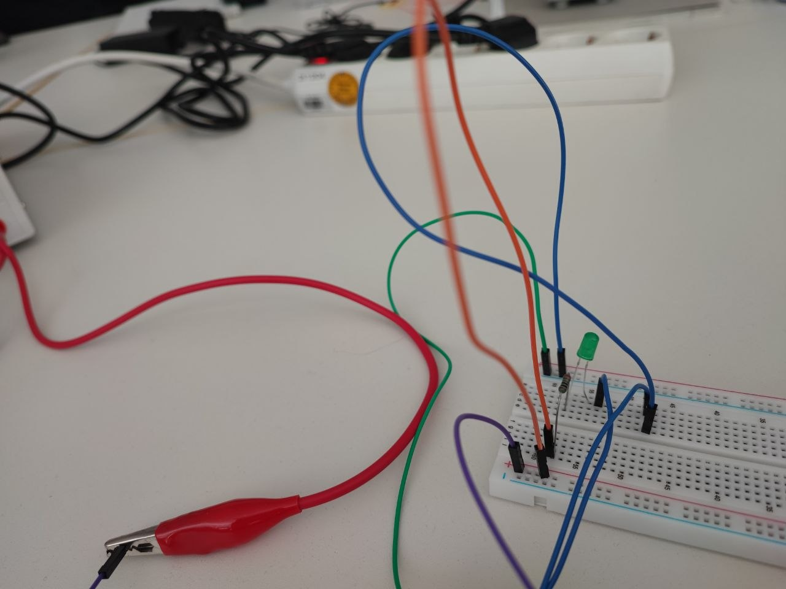
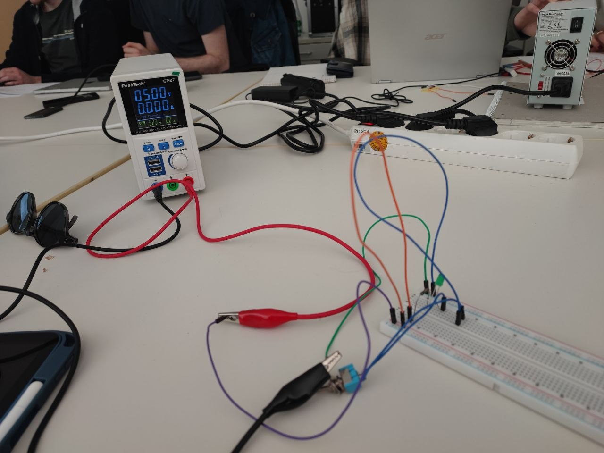
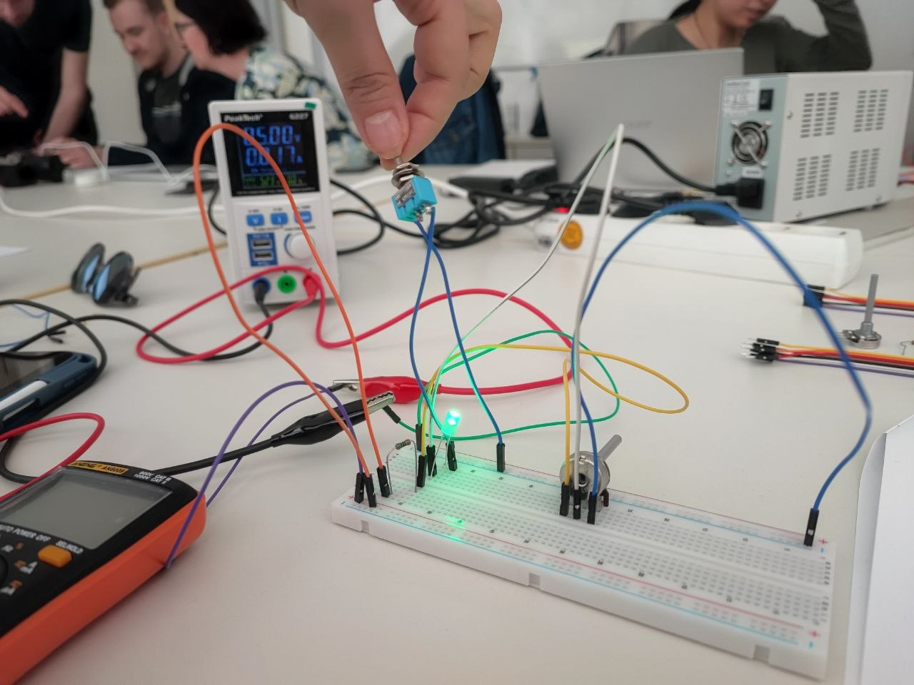
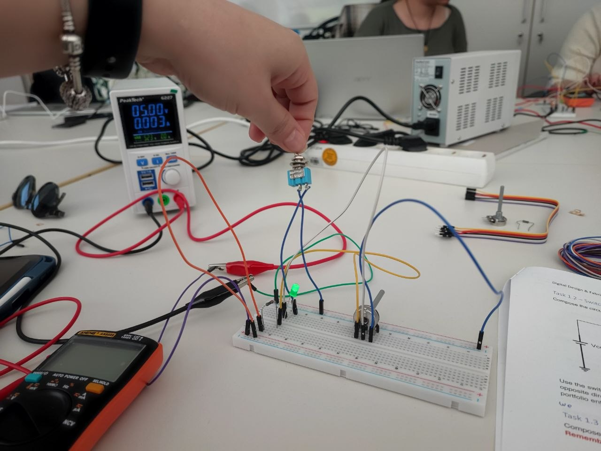
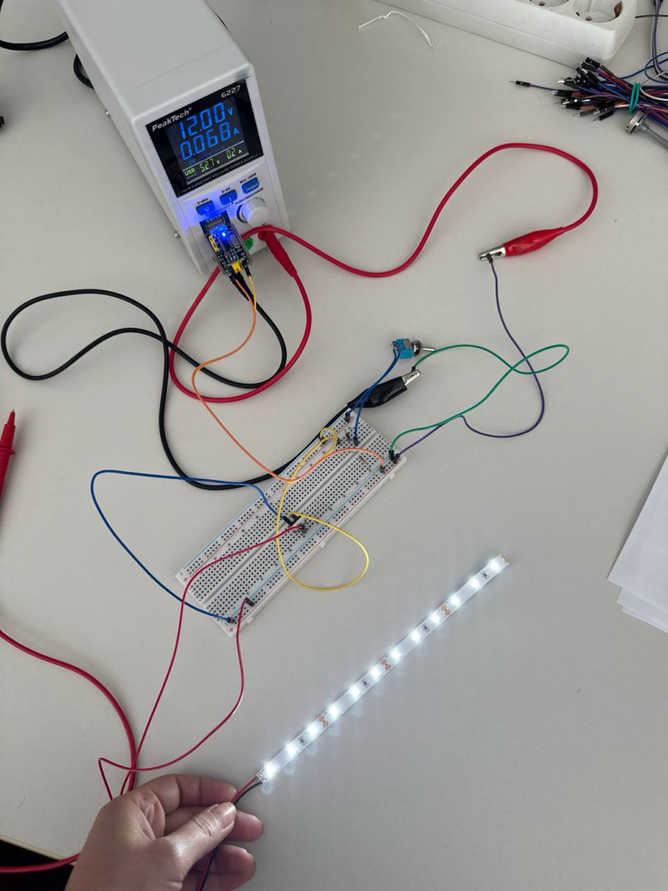
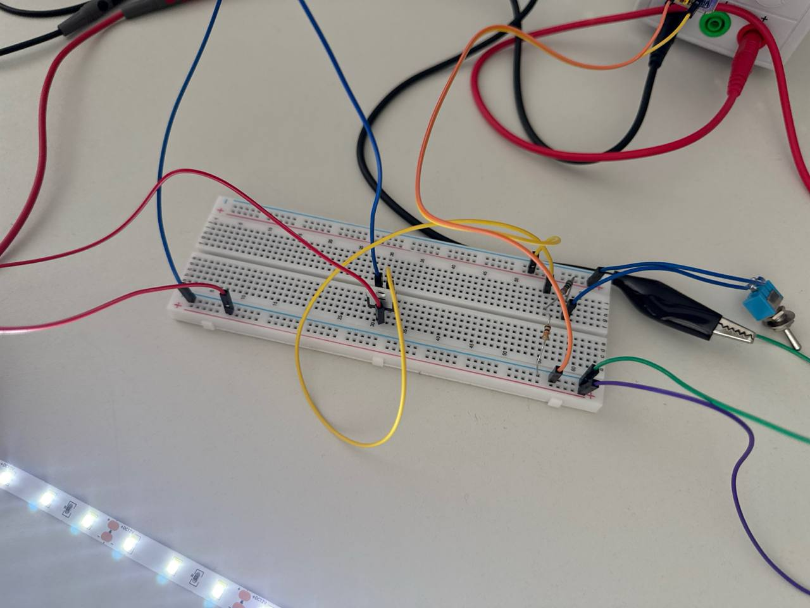
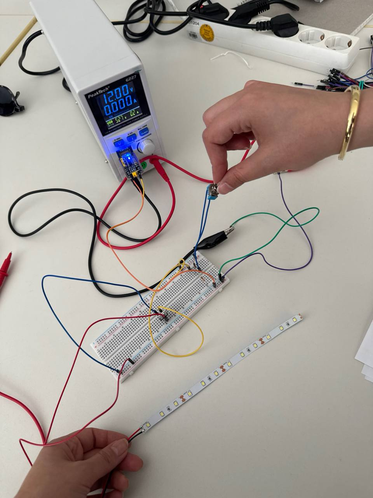

# Digital Design & Fabrication – Exercise 1  
## Electrical Circuits Portfolio

**Student:** Zahra Rajabi, Fatemeh Mazaherian
**Course:** Digital Design & Fabrication  
**University:** Carl von Ossietzky University Oldenburg  
**Lecturers:** Prof. Dr. Susanne Boll-Westermann, Mikołaj Woźniak, Tobias Lunte

---

# Overview
In this exercise, I tried to build a simple LED circuit and see what really happens when I change the resistor. I was especially curious about how it would affect the voltage and the brightness of the LED.
---

# Task 1.1 – Simple LED Circuit

## What I wanted to do
I started by setting up a basic circuit on a breadboard using a 5V power supply, a green LED, and a resistor of 220Ω.
After building the circuit, I used a multimeter to measure two things:

* the voltage across the resistor (V1)
* the voltage across the LED (V_LED)
Then I changed the resistor to higher values (1 kΩ and 4.7 kΩ) and repeated the same measurements to compare the results.

---

## Circuit Setup

---

## Measurements

| R1 (Ω) | V1 (V) | V_LED (V) |
| ------ | ------ | --------- |
| 220    | 2.09   | 2.82      |
| 1000   | 2.47   | 2.49      |
| 4700   | 2.69   | 2.31      |

---

## Initial Problem & Troubleshooting
A mistake I made and learned from:

At the beginning, my circuit didn’t work at all, and I was a bit confused.
After checking everything, I realized that I had made a mistake in how I connected the components on the breadboard. I had placed them in a way that didn’t properly complete the circuit.
Specifically, I didn’t fully understand that the current needs a continuous horizontal path on the breadboard rows to flow through the whole circuit. My connections were not aligned correctly, so the current couldn’t pass through all components.
Once I fixed the layout and made sure the components were connected along the correct rows, the circuit finally worked.
This mistake actually helped me understand how a breadboard is internally connected, which is something I had overlooked before.

---

## What I noticed

As I increased the resistance, the LED clearly became dimmer.

At the same time:
* the voltage across the resistor increased slightly
* the voltage across the LED decreased

---

## Why this happens
A larger resistor limits the current flowing through the circuit.
Less current means less brightness in the LED.
Also, since the total voltage is fixed (5V), increasing the resistor causes a larger voltage drop across it, leaving less voltage for the LED

---

## What I learned

This experiment helped me understand how resistors control current in a circuit.
Also, making and fixing my mistake with the breadboard made me more confident in building circuits. It showed me that even small connection errors can stop everything from working.
If I had more time, I would test more resistor values and maybe analyze the relationship more precisely.

---
# Task 1.2 – Switchable LED Circuit

## What I wanted to explore

In this task, I wanted to understand how a switch affects an LED circuit and whether the direction of the switch or the LED makes any difference.

---

## Video Demonstration

[▶ Watch Video Demo](videos/task2_1_demo.mp4.mov)

---

## What I did
I built the circuit based on the given schematic using:
a 5V power supply
a resistor (220Ω)
an LED
a switch
Then I tested two things:
I changed the direction of the switch
I reversed the direction of the LED
and observed what happened in each case.

---

## Circuit Setup

---

## What I noticed
First, I focused on the switch.
When I flipped or reversed the switch connections, nothing changed in the circuit behavior. The LED still turned on and off normally when the switch was closed or open.
But when I changed the direction of the LED, the result was completely different.
When the LED was connected correctly → it lit up
When I reversed it → it did not light up at all

---

## Why this happens
This helped me understand an important difference between components:
The switch has no polarity. It only opens or closes the circuit, so its direction does not matter.
The LED has polarity. It only allows current to flow in one direction.
So if the LED is connected in the wrong direction, the current cannot pass through it, and it stays off.

---

## What I learned
This experiment made a key concept very clear for me.
At first, I thought the direction of all components might matter, but now I understand that only some components (like LEDs) are directional.
Understanding polarity is very important, because if a component like an LED is connected incorrectly, the circuit will not work even if everything else is correct.
The switch is simple — it just controls whether the circuit is open or closed.
But the LED is more sensitive and only works when connected correctly.

---
# Task 1.3 – Dimmable LED Circuit

## What I wanted to explore

In this exercise, I wanted to understand how the brightness of an LED can be controlled using a potentiometer. I was also curious to see how the voltages change and what kind of relationship exists between them.

---

## Circuit Setup

---

## What I did

While building the circuit, I learned an important practical point about the potentiometer:

- The middle pin (wiper) is the output and is connected to the circuit path toward the LED using a jumper wire.
- ⚠️ It is not directly connected only to the LED, but is actually part of the complete current path in the circuit.
- The right pin is connected to the resistor.
- The left pin is connected to ground (the negative side of the breadboard).

Understanding this helped me wire the circuit correctly.

---

## Measurements

| Position | V_LED (V) | V2 (V) |
|---|---|---|
| Full brightness | ~2.93 | ~2.99 |
| Dimmed | ~2.24 | ~2.23 |
| OFF | ~0.05 | ~0.04 |

---

## What I observed

When I changed the position of the potentiometer:

- The LED brightness changed smoothly, not suddenly.
- Rotating the potentiometer gradually increased or decreased the brightness.
- The LED became dimmer when the output voltage decreased.

---

# Conclusion

This exercise improved my understanding of LEDs, resistors, potentiometers, MOSFETs, and PWM-based brightness control.
It also helped me better understand breadboard connections and troubleshooting techniques.

# Task 2.1 – Switchable LED Strip

## What I wanted to explore

In this task, I wanted to understand how a MOSFET can control a high-power LED strip using a small control voltage. I was especially curious about the role of the Gate voltage and how the MOSFET behaves as an electronic switch.

---

## Circuit Setup

---

## Observations

When I built the circuit and tested the switch, the behavior was very clear:

- When I turned the switch ON, the LED strip lit up immediately.
- When I turned the switch OFF, the LED strip turned off completely.

---

## Which Voltage Did I Control?

In this experiment, I controlled the 5V signal at the Gate of the MOSFET.

At first, I thought the switch might directly power the LED strip — but that’s not what happens here.

- The 5V (from USB) is only a control signal.
- The 12V supply is the actual power source for the LED strip.

So:

- 5V → control signal (Gate)
- 12V → power source (LED strip)

The switch does not directly power the LED strip. Instead, it controls the MOSFET.

---

## How the MOSFET Works (My Understanding)

This experiment helped me understand the MOSFET as a voltage-controlled switch.

The MOSFET has three important terminals:

- Gate (G)
- Drain (D)
- Source (S)

The Gate voltage controls the entire behavior.

### When Gate = 5V

- The MOSFET turns ON.
- A connection forms between Drain and Source.
- Current flows from the 12V supply through the LED strip.
- ✅ The LED strip turns ON.

### When Gate = 0V

- The MOSFET turns OFF.
- No connection exists between Drain and Source.
- No current flows.
- ❌ The LED strip stays OFF.

So, the MOSFET acts like an electronic switch without moving parts.

---

## Initial Problem & Troubleshooting

At the beginning, my circuit did not work.

### What I did wrong

I connected the MOSFET incorrectly.

Specifically, I did not connect the Source to GND properly.

### What happened

- The Source voltage became too high.
- The voltage difference between Gate and Source became too small.

### Why this is a problem

For an N-channel MOSFET to turn ON:

V_{GS} = V_G - V_S

The Gate voltage must be higher than the Source voltage.

In my incorrect setup:

- Gate = 5V
- Source = also high (not 0V)

So:

- ❌ \(V_{GS}\) was too small.
- ❌ The MOSFET stayed OFF.

### How I fixed it

I connected the Source directly to GND.

Now:

- Gate = 5V
- Source = 0V

So:

V_{GS} = 5V - 0V = 5V

- ✅ The MOSFET turned ON correctly.
- ✅ The LED strip worked properly.

---

## What I learned

This experiment helped me better understand how MOSFETs work in real circuits.

I learned that:

- The MOSFET is controlled by voltage, not directly by current.
- The Gate voltage alone is not enough — the difference between Gate and Source is what matters.
- Correct grounding is extremely important in electronic circuits.
- A small 5V signal can control a much larger 12V power circuit safely and efficiently.

- # Task 2.2 – PWM Controlled LED Strip

# A) Duty Cycle Analysis

## What I wanted to explore

In this part of the experiment, I wanted to understand how changing the PWM duty cycle affects the brightness of the LED strip.

---

## Circuit Setup

---

## Measurements & Observations

| Duty Cycle | Observation |
|---|---|
| 2% | Very dim, barely visible |
| 15% | Slightly brighter |
| 40% | Clearly visible brightness increase |
| 75% | Very bright |
| 100% | Fully ON, maximum brightness |

---

## Analysis

In this part of the experiment, I changed the duty cycle of the PWM signal and observed how the LED strip behaved.
At the beginning, when the duty cycle was very low (for example 2%), the LED strip was very dim. It was barely visible because it was ON for a very short time and OFF most of the time.
As I increased the duty cycle to 15% and then 40%, I could clearly see that the brightness increased. The LED became more visible and brighter step by step.

When I set the duty cycle to 75%, the LED was already quite bright, since it stayed ON most of the time.
Finally, at 100% duty cycle, the LED was fully ON all the time and reached its maximum brightness.

---

## Why this happens

The LED switches ON and OFF very quickly.
The duty cycle controls how long the LED stays ON during each cycle.

- A small duty cycle → short ON-time → dim LED
- A large duty cycle → long ON-time → bright LED

So, increasing the ON-time increases the average power delivered to the LED strip.

---

## What I learned

This experiment helped me understand how PWM controls brightness efficiently.
I learned that:

- Brightness does not depend only on voltage.
- Rapid switching can control perceived brightness.
- A higher duty cycle produces a brighter LED.
- PWM allows smooth brightness control without continuously changing the supply voltage.

Overall, I observed a simple and nearly linear relationship between duty cycle and brightness.
