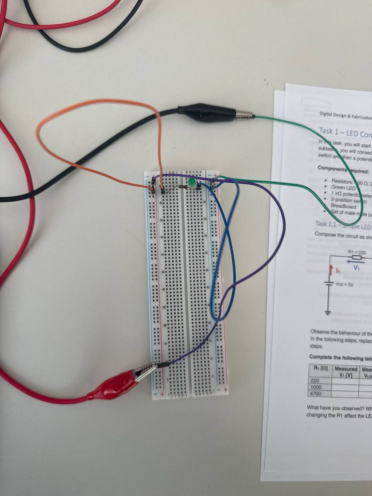
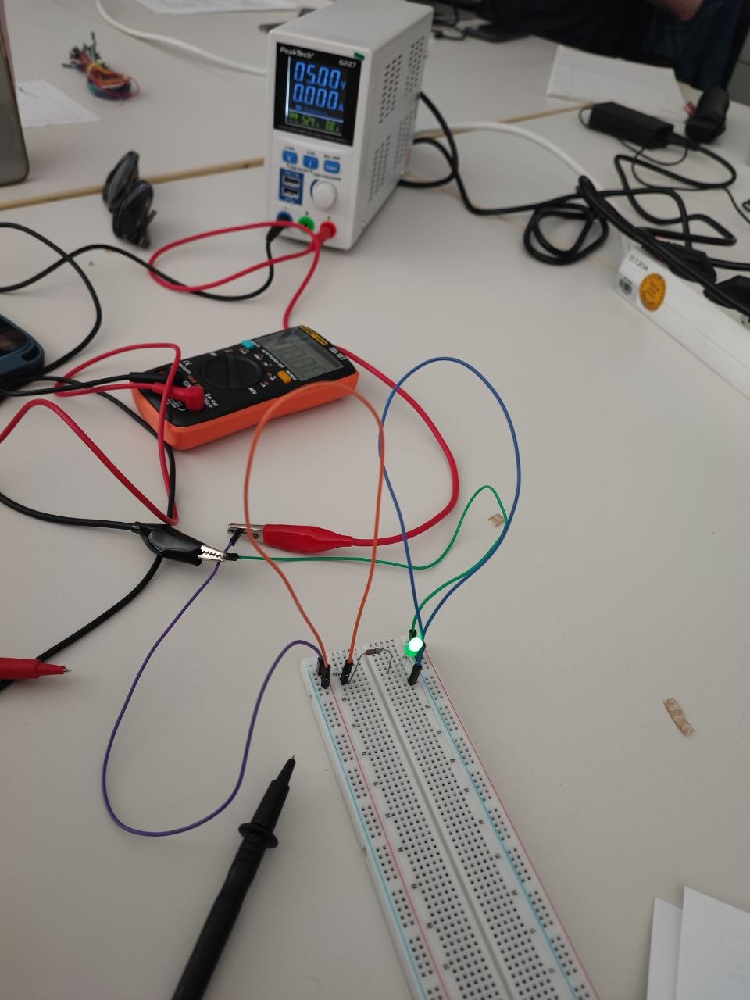
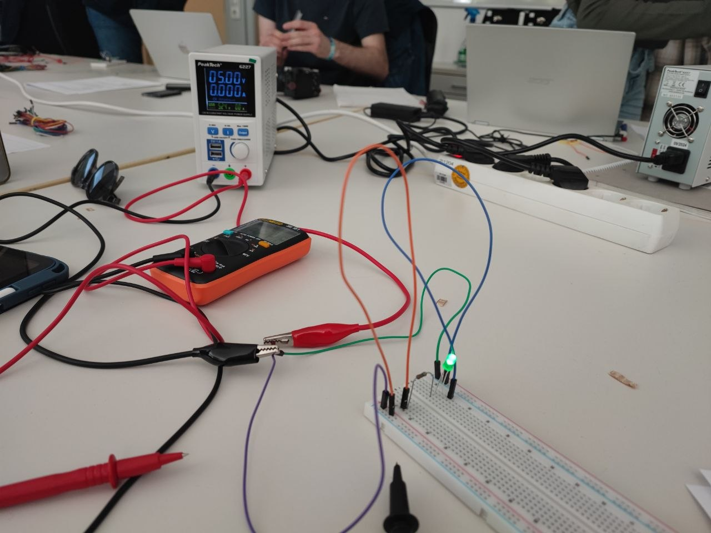
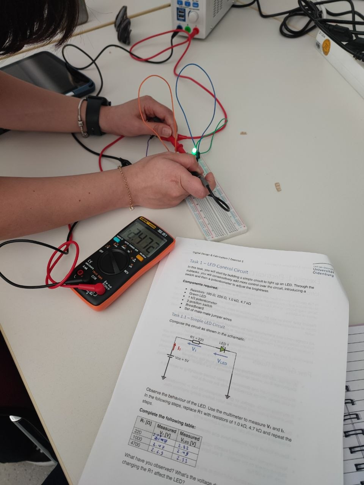
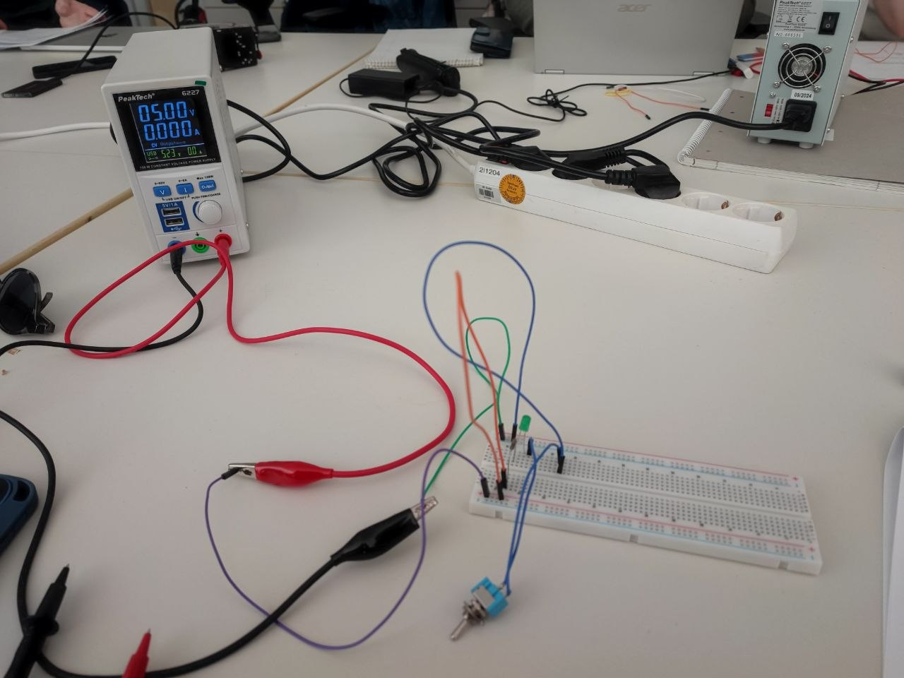
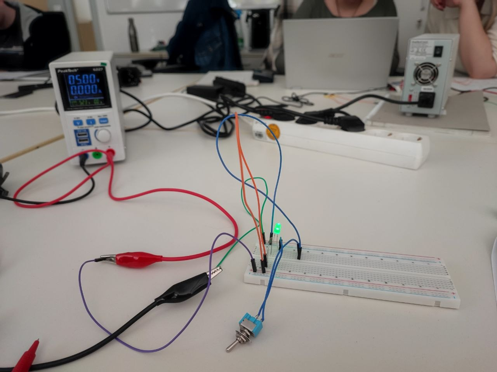

# Digital Design & Fabrication – Exercise 1  
## Electrical Circuits Portfolio

**Students:** Zahra Rajabi, Fatemeh Mazaherian
**Course:** Digital Design & Fabrication  
**University:** Carl von Ossietzky University Oldenburg  

---

# Overview
In this exercise, I tried to build a simple LED circuit and see what really happens when I change the resistor. I was especially curious about how it would affect the voltage and the brightness of the LED.
---

# Task 1.1 – Simple LED Circuit

## What I wanted to do
I started by setting up a basic circuit on a breadboard using a 5V power supply, a green LED, and a resistor of 220Ω.
After building the circuit, I used a multimeter to measure two things:

* the voltage across the resistor (V1)
* the voltage across the LED (V_LED)
Then I changed the resistor to higher values (1 kΩ and 4.7 kΩ) and repeated the same measurements to compare the results.

---

## Circuit Setup

---

## Measurements

| R1 (Ω) | V1 (V) | V_LED (V) |
| ------ | ------ | --------- |
| 220    | 2.09   | 2.82      |
| 1000   | 2.47   | 2.49      |
| 4700   | 2.69   | 2.31      |

---

## Initial Problem & Troubleshooting
A mistake I made and learned from:

At the beginning, my circuit didn’t work at all, and I was a bit confused.
After checking everything, I realized that I had made a mistake in how I connected the components on the breadboard. I had placed them in a way that didn’t properly complete the circuit.
Specifically, I didn’t fully understand that the current needs a continuous horizontal path on the breadboard rows to flow through the whole circuit. My connections were not aligned correctly, so the current couldn’t pass through all components.
Once I fixed the layout and made sure the components were connected along the correct rows, the circuit finally worked.
This mistake actually helped me understand how a breadboard is internally connected, which is something I had overlooked before.

---

## What I noticed

As I increased the resistance, the LED clearly became dimmer.

At the same time:
* the voltage across the resistor increased slightly
* the voltage across the LED decreased

---

## Why this happens
A larger resistor limits the current flowing through the circuit.
Less current means less brightness in the LED.
Also, since the total voltage is fixed (5V), increasing the resistor causes a larger voltage drop across it, leaving less voltage for the LED

---

## What I learned

This experiment helped me understand how resistors control current in a circuit.
Also, making and fixing my mistake with the breadboard made me more confident in building circuits. It showed me that even small connection errors can stop everything from working.
If I had more time, I would test more resistor values and maybe analyze the relationship more precisely.

---
# Task 1.2 – Switchable LED Circuit

## What I wanted to explore

In this task, I wanted to understand how a switch affects an LED circuit and whether the direction of the switch or the LED makes any difference.

---

## Video Demonstration

[▶ Watch Video](videos/task1_2_switchable_led.mp4)

---

## What I did
I built the circuit based on the given schematic using:
a 5V power supply
a resistor (220Ω)
an LED
a switch
Then I tested two things:
I changed the direction of the switch
I reversed the direction of the LED
and observed what happened in each case.

---

## Circuit Setup

---

## What I noticed
First, I focused on the switch.
When I flipped or reversed the switch connections, nothing changed in the circuit behavior. The LED still turned on and off normally when the switch was closed or open.
But when I changed the direction of the LED, the result was completely different.
When the LED was connected correctly → it lit up
When I reversed it → it did not light up at all

---

## Why this happens
This helped me understand an important difference between components:
The switch has no polarity. It only opens or closes the circuit, so its direction does not matter.
The LED has polarity. It only allows current to flow in one direction.
So if the LED is connected in the wrong direction, the current cannot pass through it, and it stays off.

---

## What I learned
This experiment made a key concept very clear for me.
At first, I thought the direction of all components might matter, but now I understand that only some components (like LEDs) are directional.
Understanding polarity is very important, because if a component like an LED is connected incorrectly, the circuit will not work even if everything else is correct.
The switch is simple — it just controls whether the circuit is open or closed.
But the LED is more sensitive and only works when connected correctly.

---
